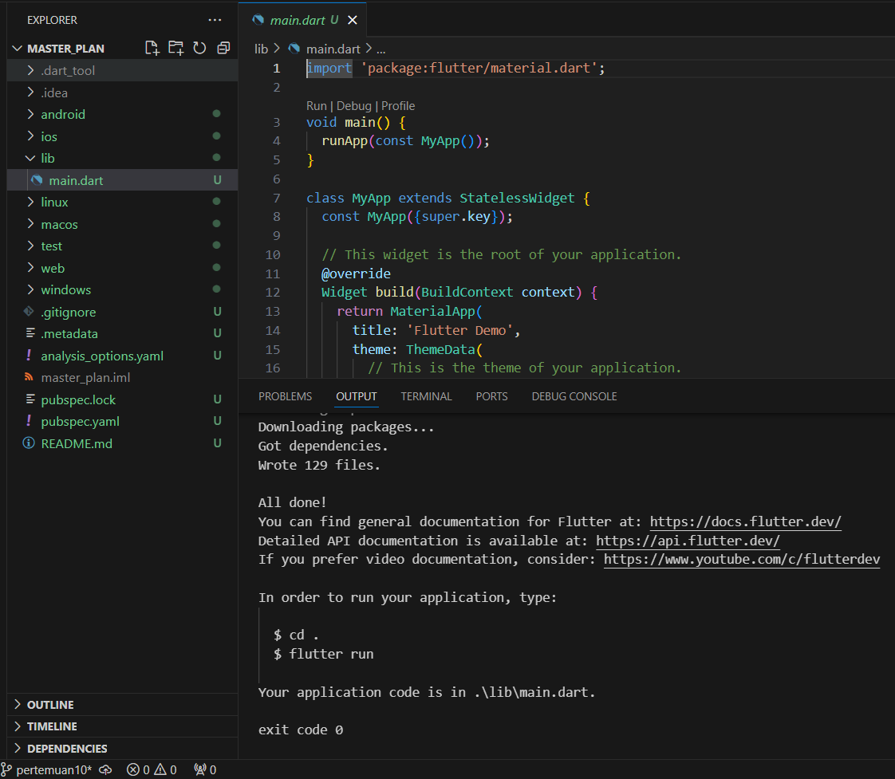

# 
Laporan Pertemuan 10
## 
Dasar State Management
## 
NIM: 2241720131
## 
Nama: Mulki Hakim
## 
Kelas: TI 3-B

# Praktikum 1: Dasar State dengan Model-View

1. Buat Project Baru

    
    
2. Membuat model task.dart
3. Buat file plan.dart
4. Buat file data_layer.dart
5. Pindah ke file main.dart
6. Buat plan_screen.dart
7. Buat method _buildAddTaskButton()
8. Buat widget _buildList()
9. Buat widget _buildTaskTile
10. Tambah Scroll Controller
11. Tambah Scroll Listener
12. Tambah controller dan keyboard behavior
13. Terakhir, tambah method dispose()
14. Hasil

#  Tugas Praktikum 1: Dasar State dengan Model-View
1. Selesaikan langkah-langkah praktikum tersebut, lalu dokumentasikan berupa GIF hasil akhir praktikum beserta penjelasannya di file README.md! Jika Anda menemukan ada yang error atau tidak berjalan dengan baik, silakan diperbaiki.
2. Jelaskan maksud dari langkah 4 pada praktikum tersebut! Mengapa dilakukan demikian?
3. Mengapa perlu variabel plan di langkah 6 pada praktikum tersebut? Mengapa dibuat konstanta ?
4. Lakukan capture hasil dari Langkah 9 berupa GIF, kemudian jelaskan apa yang telah Anda buat!
5. Apa kegunaan method pada Langkah 11 dan 13 dalam lifecyle state ?

# Praktikum 2: Mengelola Data Layer dengan InheritedWidget dan InheritedNotifier

1. Buat file plan_provider.dart
2. Edit main.dart
3. Tambah method pada model plan.dart
4. Pindah ke PlanScreen
5. Edit method _buildAddTaskButton
6. Edit method _buildTaskTile
7. Edit _buildList
8. Tetap di class PlanScreen
9. Tambah widget SafeArea

# Tugas Praktikum 2: InheritedWidget

1. Selesaikan langkah-langkah praktikum tersebut, lalu dokumentasikan berupa GIF hasil akhir praktikum beserta penjelasannya di file README.md! Jika Anda menemukan ada yang error atau tidak berjalan dengan baik, silakan diperbaiki sesuai dengan tujuan aplikasi tersebut dibuat.
2. Jelaskan mana yang dimaksud InheritedWidget pada langkah 1 tersebut! Mengapa yang digunakan InheritedNotifier?
3. Jelaskan maksud dari method di langkah 3 pada praktikum tersebut! Mengapa dilakukan demikian?
4. Lakukan capture hasil dari Langkah 9 berupa GIF, kemudian jelaskan apa yang telah Anda buat!

# Praktikum 3: Membuat State di Multiple Screens

1. Edit PlanProvider
2. Edit main.dart
3. Edit plan_screen.dart
4. Error
5. Tambah getter Plan
6. Method initState()
7. Widget build
8. Edit _buildTaskTile
9. Buat screen baru
10. Pindah ke class _PlanCreatorScreenState
11. Pindah ke method build
12. Buat widget _buildListCreator
13. Buat void addPlan()
14. Buat widget _buildMasterPlans()

# Tugas Praktikum 3: State di Multiple Screens

1. Selesaikan langkah-langkah praktikum tersebut, lalu dokumentasikan berupa GIF hasil akhir praktikum beserta penjelasannya di file README.md! Jika Anda menemukan ada yang error atau tidak berjalan dengan baik, silakan diperbaiki sesuai dengan tujuan aplikasi tersebut dibuat.
2. Berdasarkan Praktikum 3 yang telah Anda lakukan, jelaskan maksud dari gambar diagram berikut ini!

    

Lakukan capture hasil dari Langkah 14 berupa GIF, kemudian jelaskan apa yang telah Anda buat!