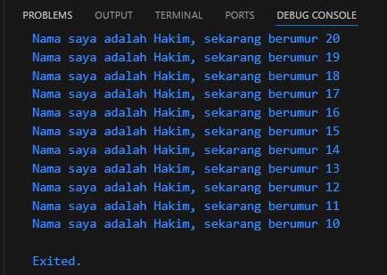

# <center> Laporan Pertemuan 2
## <center> Pemrograman Dasar Dart - Bag.1
## <center>NIM: 2241720131
## <center>Nama: Mulki Hakim
## <center>Kelas: TI 3-B

# Tugas Praktikum
1. Modifikasilah kode pada baris 3 di VS Code atau Editor Code favorit Anda berikut ini agar mendapatkan keluaran (output) sesuai yang diminta!

    jawab:
    ```dart
    void main() { 
        for (int i = 20; i > 9; i--) { 
            print('Nama saya adalah Hakim, sekarang berumur ${i}'); 
        } 
    }
    ```
    output:
    
    
2. Mengapa sangat penting untuk memahami bahasa pemrograman Dart sebelum kita menggunakan framework Flutter ? Jelaskan!

    jawab:

    karena base dari pembelajaran framework yaitu bahasa pemrograman yang digunakannya, tidak hanya framework flutter dengan dart tetapi framework lainnya juga seperti laravel dengan php, react.js dengan javascript dll.
3. Rangkumlah materi dari codelab ini menjadi poin-poin penting yang dapat Anda gunakan untuk membantu proses pengembangan aplikasi mobile menggunakan framework Flutter.

    jawab:
    
* Pengenalan Dart
    - kelebihan bahasa pemrograman dart untuk menunjang pengembangan aplikasi mobile menggunakan framework flutter:
        - productive tooling -> untuk menganalisis kode, plugin IDE, dan ekosistem paket yang besar.
        - garbage collection -> mengelola memori dan objek dalam memori yang tidak lagi digunakan.
        - type annotations -> keamanan, mengontrol semua data dalam aplikasi.
        - statically typed -> analisis types saat runtime, menemukan bug selama kompilasi kode.
        - portability -> dikompilasi secara native ke kode Advanced RISC Machines (ARM) dan x86.
* Cara Kerja Dart

    - Ekseskusi kode dart dapat dilakukan dengan dua cara, yaitu Dart VMs dan javascript compilations.
    - Lingkungan yang mendukung bahasa Dart perlu memperhatikan fitur-fitur penting seperti berikut:
        - Runtime systems
        - Dart core libraries
        - Garbage collectors
    - Eksekusi kode Dart dapat beroperasi dalam dua mode 
        - kompilasi Just-In-Time (JIT) -> tempat kode sumber dikompilasi sesuai kebutuhan, menjalankan kode selama masa pengembangan, dan dapat memanfaatkan fitur seperti debugging dan hot reload.
        - Kompilasi Ahead-Of-Time (AOT) -> bekerja lebih seperti sistem runtime Dart, yang menyediakan garbage collector dan metode-metode native dari Dart software development kit (SDK) pada aplikasi.
4. Buatlah slide yang berisi penjelasan dan contoh eksekusi kode tentang perbedaan Null Safety dan Late variabel !

    jawab:

* Null Safety adalah fitur yang memastikan variabel tidak dapat memiliki nilai null kecuali secara eksplisit dinyatakan bisa. Null Safety diperkenalkan di Dart 2.12 dan memaksa programmer untuk menangani kemungkinan null secara eksplisit.
* contoh kode null safety:
    ```dart
    void main() {
        int a = 10;            // Non-nullable, tidak bisa null
        int? b;                // Nullable, bisa null
        
        b = null;              // Ini valid, karena 'b' adalah nullable
        a = null;              // Ini akan error, karena 'a' adalah non-nullable
        
        if (b != null) {
            print(b + 5);        // Aman digunakan setelah cek null
        } else {
            print("b is null");
        }
    }
    ```
    Dalam contoh di atas:

    - int a tidak bisa diberi nilai null.
    - int? b bisa diberi nilai null, tapi kita harus memeriksa apakah nilainya null sebelum menggunakannya untuk menghindari kesalahan runtime.
* Late Variables memungkinkan kita untuk menunda inisialisasi variabel sampai nanti ketika diperlukan. Ini berguna ketika kita ingin memastikan bahwa variabel diinisialisasi sebelum digunakan, tetapi kita belum memiliki nilai untuk memberikannya pada saat deklarasi.
* contoh kodel late variables
    ```dart
    void main() {
        late int a;   // Deklarasi variabel 'a' tanpa inisialisasi
        
        a = 10;       // Inisialisasi variabel 'a'
        print(a);     // Menggunakan variabel 'a' setelah inisialisasi
        
        late int b = calculateValue(); // Late dengan inisialisasi
        print(b);     // Nilai 'b' dihitung ketika pertama kali diakses
    }

    int calculateValue() {
        print("Calculating value...");
        return 42;
    }
    ```
    Dalam contoh di atas:

    - late int a dideklarasikan tanpa inisialisasi langsung, tetapi kita harus menginisialisasinya sebelum digunakan.
    - late int b diinisialisasi dengan hasil dari fungsi calculateValue() yang hanya dipanggil ketika variabel b diakses pertama kali.
