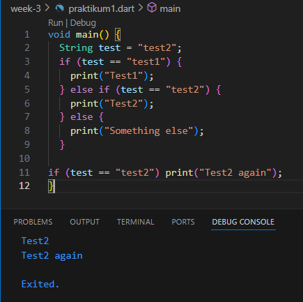
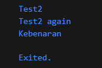
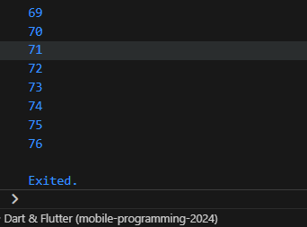
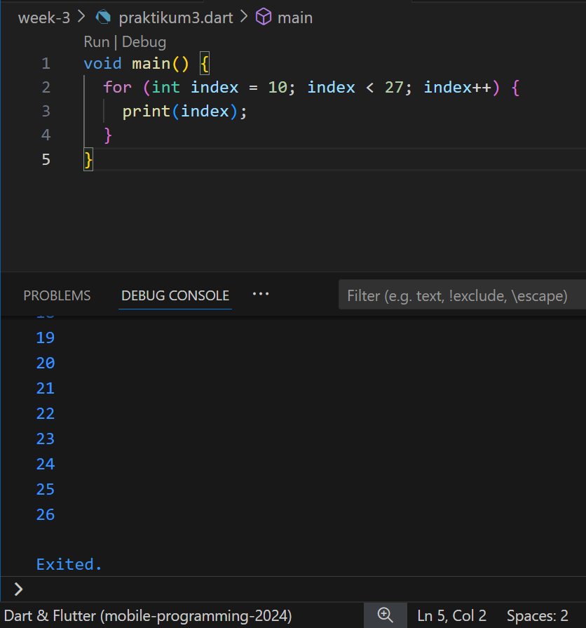
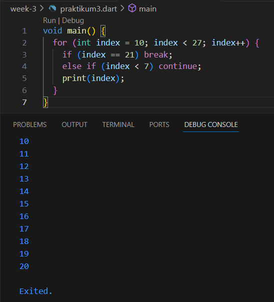
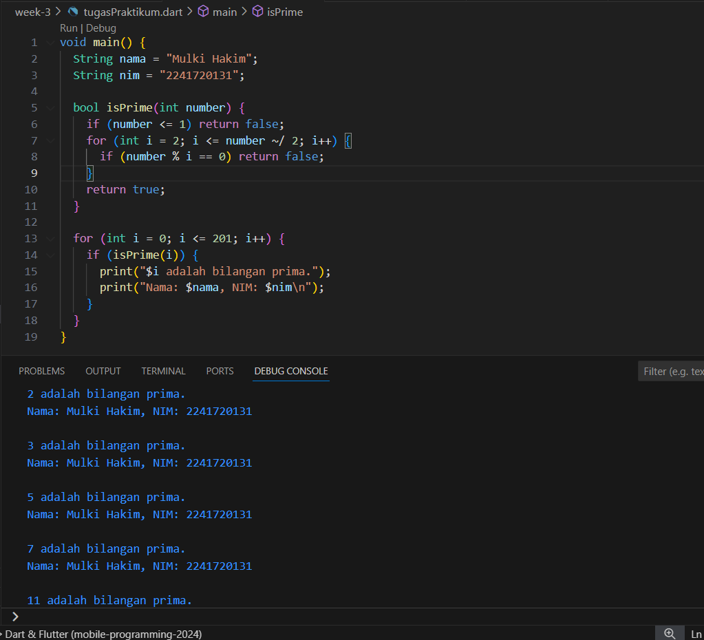

# <center> Laporan Pertemuan 3
## <center> Pemrograman Dasar Dart - Bag.2
## <center>NIM: 2241720131
## <center>Nama: Mulki Hakim
## <center>Kelas: TI 3-B

# Praktikum 1 : Menerapkan Control Flows ("if/else")
## Langkah 1

## Langkah 2
pada langkah 1 tersebut. Apa yang terjadi? Jelaskan!
jawab:

pada bagian nested if, dilakukan pengecekan apakah nilai dari variabel test sama dengan nilai yang telah diinisialisasikan di awal jika di dalam nested if suatu kondisi terpenuhi maka akan langsung dijalankankan proses di dalamnya. Kemudian keluar dari nested if dan menjalankan pemilihan selanjutnya, jika kondisi terpenuhi maka proses akan dijalankan.
## Langkah 3
Tambahkan kode program berikut, lalu coba eksekusi (Run) kode Anda.
```dart
String test = "true";
if (test) {
    print("Kebenaran");
}
```
Apa yang terjadi ? Jika terjadi error, silakan perbaiki namun tetap menggunakan if/else.

jawab:

terjadi eror, karena variabel test nilai nya telah diinisialisasikan, namun jika dibuat variabel baru lagi dengan nilai yang sama, jika ditest dengan kode program pemilihan di atas akan terjadi eror juga, hal tersebut dikarenakan operasi if tidak bisa mengecek kondisi dimana variabel kondisi tidak diinisialisasikan nilai string nya. pembenaran kode yaitu:
```dart
bool test2 = true;
if (test2) {
   print("Kebenaran");
}
```
output:


#
# Praktikum 2: Menerapkan Perulangan "while" dan "do-while"
## Langkah 1
Ketik atau salin kode program berikut ke dalam fungsi main().
```dart
void main() {
  int counter = 0;
  while (counter < 33) {
    print(counter);
    counter++;
  }
}
```
## Langkah 2
Silakan coba eksekusi (Run) kode pada langkah 1 tersebut. Apa yang terjadi? Jelaskan! Lalu perbaiki jika terjadi error.

jawab:

dari kode tersebut awalnya terjadi eror, karena variabel counter belum dideklarasikan dan diinisialisasikan nilainya. namun setelah diubah, kode tersebut akan mencetak nilai variabel counter jika sesuai dalam kondisi perulangan while.
## Langkah 3
Tambahkan kode program berikut, lalu coba eksekusi (Run) kode Anda.
```dart
do {
  print(counter);
  counter++;
} while (counter < 77);
```
Apa yang terjadi ? Jika terjadi error, silakan perbaiki namun tetap menggunakan do-while.

jawab:

kondisi perualangan tersebut dapat dijalankan, asalkan variabel counter dideklarasi dan diinisialisasikan nilainya terlebih dahulu.

output:


#
# Praktikum 3: Menerapkan Perulangan "for" dan "break-continue"
## Langkah 1
Ketik atau salin kode program berikut ke dalam fungsi main().
```dart
for (Index = 10; index < 27; index) {
  print(Index);
}
```
## Langkah 2
Silakan coba eksekusi (Run) kode pada langkah 1 tersebut. Apa yang terjadi? Jelaskan! Lalu perbaiki jika terjadi error.

jawab:

kode di atas akan terjadi eror, karena variabel index belum dideklarasikan dan modifier perulangan tidak berubah increment/decrement. perbaikan dan outputnya yaitu

## Langkah 3
Tambahkan kode program berikut di dalam for-loop, lalu coba eksekusi (Run) kode Anda.
```dart
if (Index == 21) break;
else if (index > 1 || index < 7) continue;
print(index);
```
Apa yang terjadi ? Jika terjadi error, silakan perbaiki namun tetap menggunakan for dan break-continue.

jawab:

terjadi error karena kondisi index > 1 akan selalu bernilai true, kemudian nilai index yang sesuai perulangan akan selalu dilewati (continue). perbaikan dan outputnya yaitu:

# Tugas Praktikum
1. Silakan selesaikan Praktikum 1 sampai 3, lalu dokumentasikan berupa screenshot hasil pekerjaan beserta penjelasannya!
2. Buatlah sebuah program yang dapat menampilkan bilangan prima dari angka 0 sampai 201 menggunakan Dart. Ketika bilangan prima ditemukan, maka tampilkan nama lengkap dan NIM Anda.

    jawab:

3. Kumpulkan berupa link commit repo GitHub pada tautan yang telah disediakan di grup Telegram!