# <center> Laporan Pertemuan 3
## <center> Pemrograman Dasar Dart - Bag.2
## <center>NIM: 2241720131
## <center>Nama: Mulki Hakim
## <center>Kelas: TI 3-B

# Praktikum 1: Eksperimen Tipe Data List
## Langkah 1:
Ketik atau salin kode program berikut ke dalam void main().
```dart
void main() {
  var list = [1, 2, 3];
  assert(list.length == 3);
  assert(list[1] == 2);
  print(list.length);
  print(list[1]);

  list[1] = 1;
  assert(list[1] == 1);
  print(list[1]);
}
```
## Langkah 2:
Silakan coba eksekusi (Run) kode pada langkah 1 tersebut. Apa yang terjadi? Jelaskan!

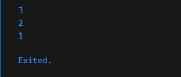

hasil run pada kode yaitu, 3 untuk panjang list, 2 untuk nilai elemen pada indeks 1, 1 untuk nilai elemen pada indeks yang nilai nya telah diubah.
## Langkah 3:
Ubah kode pada langkah 1 menjadi variabel final yang mempunyai index = 5 dengan default value = null. Isilah nama dan NIM Anda pada elemen index ke-1 dan ke-2. Lalu print dan capture hasilnya.

Apa yang terjadi ? Jika terjadi error, silakan perbaiki.

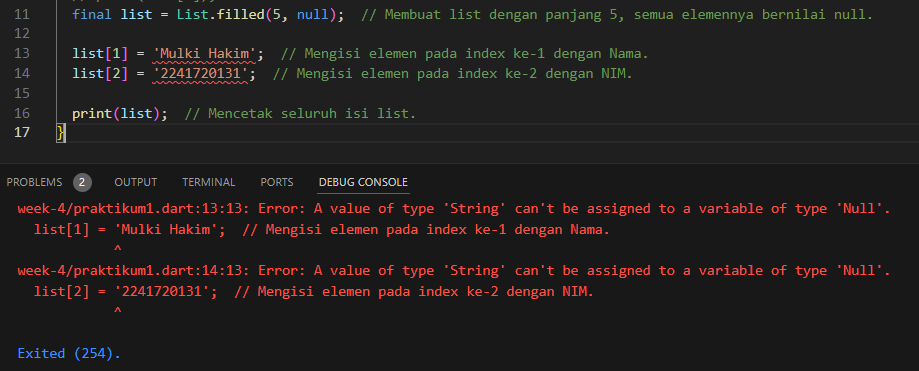

terjadi error karena variabel final pada tipe data List< null >, menganggap bahwa tipe list tersebut tidak dapat memasukkan nilai selain null. Perbaikannya, agar dapat diisi dengan tipe data String atau tipe lain yaitu menggunakan tipe List< dynamic>.

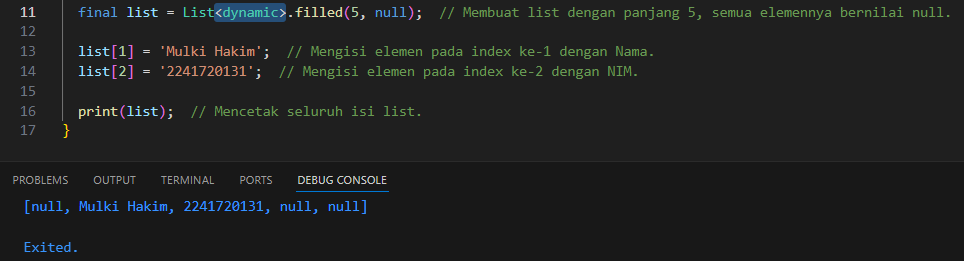

# Praktikum 2: Eksperimen Tipe Data Set
## Langkah 1:
Ketik atau salin kode program berikut ke dalam fungsi main().
```dart
void main() {
  var halogens = {'fluorine', 'chlorine', 'bromine', 'iodine', 'astatine'};
  print(halogens);
}
```
## Langkah 2:
Silakan coba eksekusi (Run) kode pada langkah 1 tersebut. Apa yang terjadi? Jelaskan! Lalu perbaiki jika terjadi error.

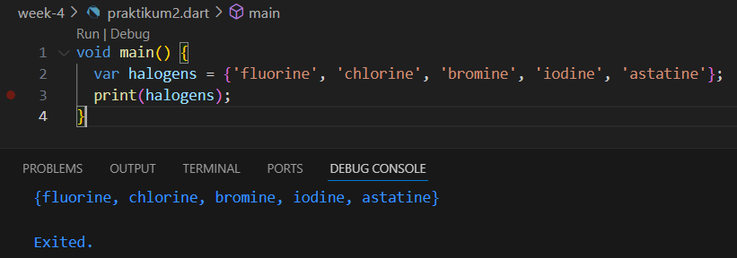

yang terjadi yaitu mencetak semua elemen bertipe String yang ada pada variabel halogens.

## Langkah 3:
Tambahkan kode program berikut, lalu coba eksekusi (Run) kode Anda.
```dart
var names1 = <String>{};
Set<String> names2 = {}; // This works, too.
var names3 = {}; // Creates a map, not a set.

print(names1);
print(names2);
print(names3);
```
Apa yang terjadi ? Jika terjadi error, silakan perbaiki namun tetap menggunakan ketiga variabel tersebut. Tambahkan elemen nama dan NIM Anda pada kedua variabel Set tersebut dengan dua fungsi berbeda yaitu .add() dan .addAll().

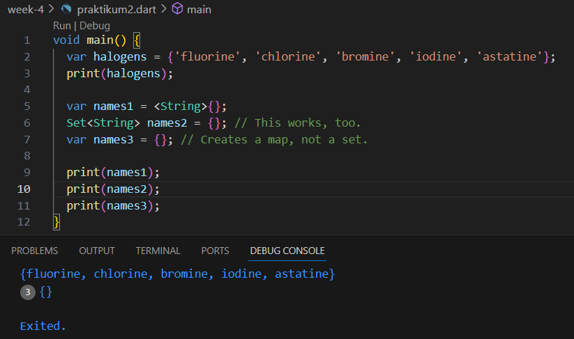

tidak terjadi error, namun pada variabel names1 dan names2 menampilkan set yang kosong, sedangkan variable names3 menampilkan Map< dynamic, dynamic>, yang juga map kosong. ketiga nya menampilkan kurang kurawal yang kosong.

perbaikan dan penambahan elemen menggunakan add() dan addAll().

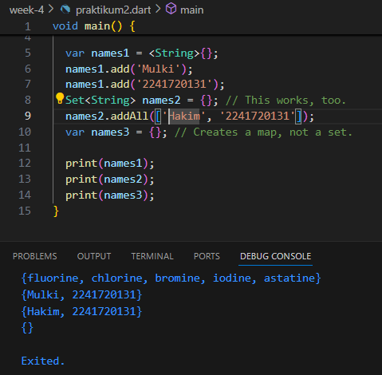

# Praktikum 3: Eksperimen Tipe Data Maps
## Langkah 1:
Ketik atau salin kode program berikut ke dalam fungsi main().
```dart
void main() {
  var gifts = {
  // Key:    Value
  'first': 'partridge',
  'second': 'turtledoves',
  'fifth': 1
};

var nobleGases = {
  2: 'helium',
  10: 'neon',
  18: 2,
};

print(gifts);
print(nobleGases);
}
```
## Langkah 2:
Silakan coba eksekusi (Run) kode pada langkah 1 tersebut. Apa yang terjadi? Jelaskan! Lalu perbaiki jika terjadi error.

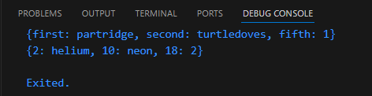

tidak terjadi error, kode akan menampilkan 2 buah map(gifts dan nobbleGases), dengan rincian. Map gifts meruapakan variabel Map< String, Object> dikarenakan key dari map bertipe string dan value nya berupa campuran String dan int. Kemudian Map nobbleGases merupakan variabel Map< int, Object> dikarenakan key dari map bertipe int dan value nya berupa campuran String dan int.

## Langkah 3:
Tambahkan kode program berikut, lalu coba eksekusi (Run) kode Anda.
```dart
var mhs1 = Map<String, String>();
gifts['first'] = 'partridge';
gifts['second'] = 'turtledoves';
gifts['fifth'] = 'golden rings';

var mhs2 = Map<int, String>();
nobleGases[2] = 'helium';
nobleGases[10] = 'neon';
nobleGases[18] = 'argon';
```
Apa yang terjadi ? Jika terjadi error, silakan perbaiki.

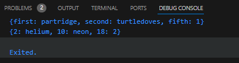

tidak terjadi eror karena pada kode tambahan mengubah suatu elemen pada masing-masing map gifts dan nobleGases berdasarkan keynya. namun akhir kode program tidak dilakukan pencetakan map gifts dan nobleGases yang telah dimodifikasi.

Tambahkan elemen nama dan NIM Anda pada tiap variabel di atas (gifts, nobleGases, mhs1, dan mhs2).
```dart
void main() {
  var gifts = {
    // Key:    Value
    'first': 'partridge',
    'second': 'turtledoves',
    'fifth': 1
  };

  var nobleGases = {
    2: 'helium',
    10: 'neon',
    18: 2,
  };

  var mhs1 = Map<String, String>();
  gifts['first'] = 'partridge';
  gifts['second'] = 'turtledoves';
  gifts['fifth'] = 'golden rings';

  var mhs2 = Map<int, String>();
  nobleGases[2] = 'helium';
  nobleGases[10] = 'neon';
  nobleGases[18] = 'argon';

  gifts.addAll({
    'name': 'Mulki',
    'NIM': '2241720131'
  });
  nobleGases[19] = 'Hakim';
  nobleGases[20] = '2241720131';

  mhs1['name'] = 'Mulki';
  mhs1['NIM'] = '2241720131';
  mhs2.addAll({
    1: 'Hakim',
    2: '2241720131'
  });

  print(gifts);
  print(nobleGases);
  print(mhs1);
  print(mhs2);

}
```
output

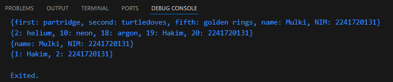

# Praktikum 4: Eksperimen Tipe Data List: Spread dan Control-flow Operators
## Langkah 1:
Ketik atau salin kode program berikut ke dalam fungsi main().
```dart
void main() {
  var list1 = [1, 2, 3];
  var list2 = [0, ...list1];
  print(list1);
  print(list2);
  print(list2.length);
}
```
## Langkah 2:
Silakan coba eksekusi (Run) kode pada langkah 1 tersebut. Apa yang terjadi? Jelaskan! Lalu perbaiki jika terjadi error.

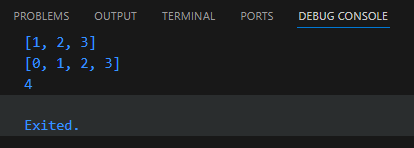

tidak terjadi eror, kode pada langkah 1 tersebut mencetak variabel list1 dengan tipe data List, lalu mencetak variabel list2 dengan tipe data List yang isi elemenya bergantung pada isi dari List list1, terakhir list2.length untuk mencetak panjang variabel list2.

## Langkah 3:
Tambahkan kode program berikut, lalu coba eksekusi (Run) kode Anda.
```dart
list1 = [1, 2, null];
print(list1);
var list3 = [0, ...?list1];
print(list3.length);
```
Apa yang terjadi ? Jika terjadi error, silakan perbaiki.

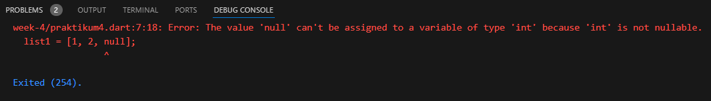

terjadi eror karena variabel list1 yang elemen ke-3 nya di ubah dengan nilai null, tidak sesuai saat awal pendefinisian var list1 = [], yang dimana hanya mengizinkan nilai null. Untuk memperbaikinya yaitu dengan mendefinisikan var list1 = <int?>[], agar dapat mengizinkan nilai null untuk dapat menjadi elemen dari list1. sebagai berikut:

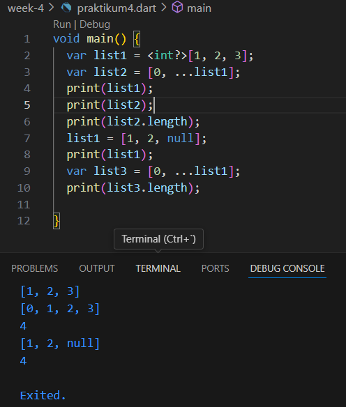

Tambahkan variabel list berisi NIM Anda menggunakan Spread Operators. 

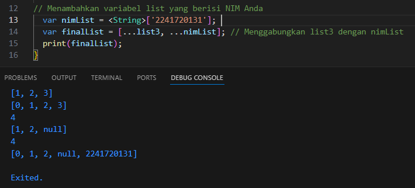

## Langkah 4:
Tambahkan kode program berikut, lalu coba eksekusi (Run) kode Anda.
```dart
var nav = ['Home', 'Furniture', 'Plants', if (promoActive) 'Outlet'];
print(nav);
```
Apa yang terjadi ? Jika terjadi error, silakan perbaiki. Tunjukkan hasilnya jika variabel promoActive ketika true dan false.
* ketika bernilai true:
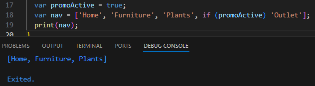
* ketika bernilai false:
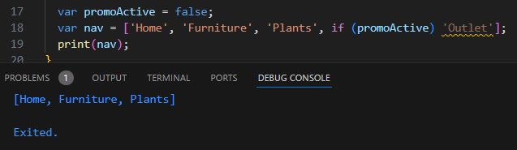
## Langkah 5:
Tambahkan kode program berikut, lalu coba eksekusi (Run) kode Anda.
```dart
var nav2 = ['Home', 'Furniture', 'Plants', if (login case 'Manager') 'Inventory'];
print(nav2);
```
Apa yang terjadi ? Jika terjadi error, silakan perbaiki. Tunjukkan hasilnya jika variabel login mempunyai kondisi lain.
* jika kondisi variabel login adalah Manager:
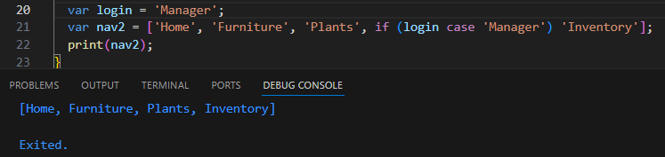
* jika kondisi variabel login adalah yang lain:
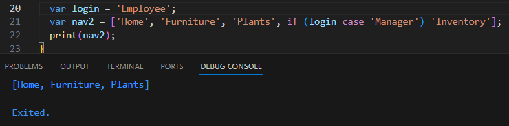
## Langkah 6:
Tambahkan kode program berikut, lalu coba eksekusi (Run) kode Anda.
```dart
var listOfInts = [1, 2, 3];
var listOfStrings = ['#0', for (var i in listOfInts) '#$i'];
assert(listOfStrings[1] == '#1');
print(listOfStrings);
```
Apa yang terjadi ? Jika terjadi error, silakan perbaiki. Jelaskan manfaat Collection For.

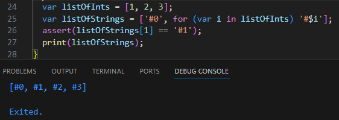

tidak terjadi eror, kemudian untuk manfaat collection for yaitu untuk membuat koleksi (seperti list atau set) dengan cara yang lebih ringkas (dengan menggunakan perulangan for).

# Praktikum 5: Eksperimen Tipe Data Records
## Langkah 1:
Ketik atau salin kode program berikut ke dalam fungsi main().
```dart
void main() {
  var record = ('first', a: 2, b: true, 'last');
  print(record);
}
```
## Langkah 2:
Silakan coba eksekusi (Run) kode pada langkah 1 tersebut. Apa yang terjadi? Jelaskan! Lalu perbaiki jika terjadi error.

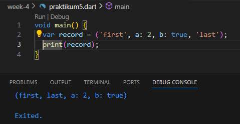

tidak terjadi eror, pada kode program menampilkan value dari variabel record bertipe data tupple/record. tipe data record dapat menyimpan nilai-nilai dengan tipe yang berbeda-beda.

## Langkah 3:
Tambahkan kode program berikut di luar scope void main(), lalu coba eksekusi (Run) kode Anda.
```dart
(int, int) tukar((int, int) record) {
  var (a, b) = record;
  return (b, a);
}
```
Apa yang terjadi ? Jika terjadi error, silakan perbaiki. Gunakan fungsi tukar() di dalam main() sehingga tampak jelas proses pertukaran value field di dalam Records.

```dart
void main() {
  var record = ('first', a: 2, b: true, 'last');
  print(record);
}
(int, int) tukar((int, int) record) {
  var (a, b) = record;
  return (b, a);
}
```
saat di run tidak terjadi apa-apa, namun fungsi tukar belum dijalankan di main. saat fungsi tukar digunakan di main, terjadi eror karena parameter record nilai nya tidak sesuai dengan parameter fungsi tukar, sehingga nilai variabel record diganti agar sesuai dengan fungsi tukar. berikut eror nya:

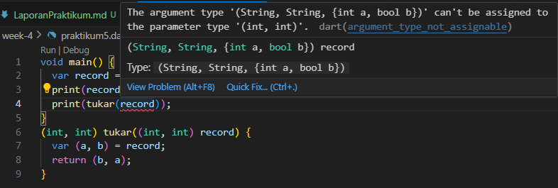

kemudian perbaikan sehingga fungsi tukar dapat dijalankan:

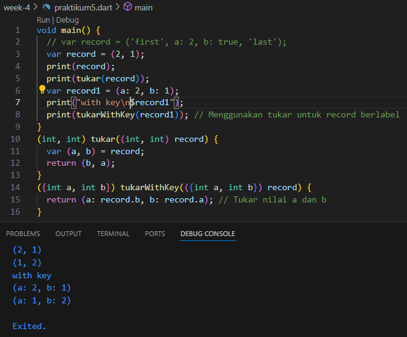

## Langkah 4:
Tambahkan kode program berikut di dalam scope void main(), lalu coba eksekusi (Run) kode Anda.
```dart
// Record type annotation in a variable declaration:
(String, int) mahasiswa;
print(mahasiswa);
```
Apa yang terjadi ? Jika terjadi error, silakan perbaiki. Inisialisasi field nama dan NIM Anda pada variabel record mahasiswa di atas. Dokumentasikan hasilnya dan buat laporannya!

terjadi eror karena variabel mahasiswa belum di deklarasi dan diinisialisasi nilai tipe data record nya. berikut pembenarannnya:

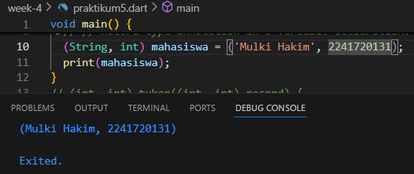

## Langkah 5:
Tambahkan kode program berikut di dalam scope void main(), lalu coba eksekusi (Run) kode Anda.
```dart
var mahasiswa2 = ('first', a: 2, b: true, 'last');

print(mahasiswa2.$1); // Prints 'first'
print(mahasiswa2.a); // Prints 2
print(mahasiswa2.b); // Prints true
print(mahasiswa2.$2); // Prints 'last'
```
Apa yang terjadi ? Jika terjadi error, silakan perbaiki. Gantilah salah satu isi record dengan nama dan NIM Anda, lalu dokumentasikan hasilnya dan buat laporannya!

tidak terjadi eror, kode program hampir sama dengan langkah sebelumnya, yang membedakan kode pada langkah 5 ini varibel mahasiswa2 tidak di deklarasikan tipe data nilai-nilai yang dapat diisi daripada tipe data record nya sendiri, sehingga program akan secara otomatis mengatur tipe data yang ada pada record setelah variabel tersebut menginisialisasikan nilai nya.

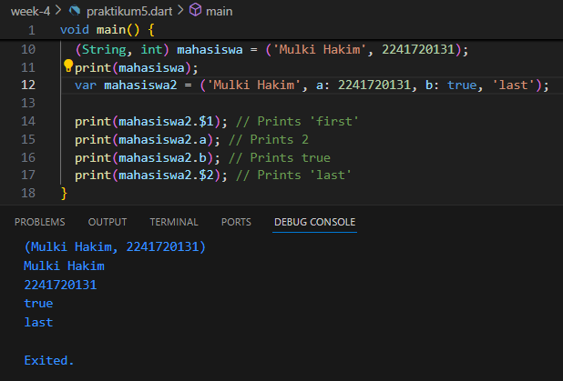

# Tugas Praktikum

1. Jelaskan yang dimaksud Functions dalam bahasa Dart!
  
    jawab
    
    Functions dalam bahasa Dart adalah blok kode yang dirancang untuk melakukan tugas tertentu, dapat dipanggil berulang kali, dan bisa menerima input (parameter) serta mengembalikan output (return value). Functions memudahkan untuk memisahkan logika program menjadi bagian-bagian yang terstruktur.
2. Jelaskan jenis-jenis parameter di Functions beserta contoh sintaksnya!

    jawab:

    * Positional Parameters: Parameter yang diurutkan berdasarkan posisinya.
      ```dart
      void greet(String name, int age) {
        print('Hello $name, you are $age years old.');
      }

      void main() {
        greet('Hakim', 20); // Positional parameter
      }
      ```
    * Optional Positional Parameters: Parameter yang bersifat opsional dan berada di dalam tanda kurung siku [], tidak harus diberikan saat function dipanggil.
      ```dart
      void greet(String name, [int? age]) {
        print('Hello $name, you are ${age ?? 'unknown'} years old.');
      }

      void main() {
        greet('Hakim'); // age is optional
      }
      ```
    * Named Parameters: Parameter yang diakses berdasarkan nama, diletakkan dalam tanda kurung kurawal {}. Ini membuat parameter lebih fleksibel dan bisa ditentukan urutannya.
      ```dart
      void greet({required String name, int age = 0}) {
        print('Hello $name, you are $age years old.');
      }

      void main() {
        greet(name: 'Hakim', age: 20); // Named parameter
      }
      ```
    * Optional Named Parameters: Mirip dengan named parameters, tetapi dapat diatur agar opsional.
      ```dart
      void greet({String? name, int age = 0}) {
        print('Hello ${name ?? 'Guest'}, you are $age years old.');
      }

      void main() {
        greet(age: 20); // Optional named parameter
      }
      ```
3. Jelaskan maksud Functions sebagai first-class objects beserta contoh sintaknya!

    jawab:

    * function dapat diperlakukan seperti objek biasa. Functions dapat disimpan dalam variabel, diteruskan sebagai argumen ke function lain, atau dikembalikan dari function.
      ```dart
      // Function disimpan dalam variabel
      void sayHello() {
        print('Hello, Dart!');
      }

      void main() {
        var greet = sayHello; // Function as object
        greet(); // Memanggil function melalui variabel
      }
      ```
    * Functions juga bisa menjadi argumen:
      ```dart
      void executeFunction(Function func) {
        func();  // Memanggil function yang dikirim sebagai argumen
      }

      void sayHello() {
        print('Hello from function!');
      }

      void main() {
        executeFunction(sayHello);  // Passing function sebagai argumen
      }
      ```
4. Apa itu Anonymous Functions? Jelaskan dan berikan contohnya!
    
    jawab:

    Anonymous Functions adalah fungsi tanpa nama, sering disebut juga sebagai lambda atau closure. Mereka didefinisikan langsung di tempat di mana mereka dibutuhkan, misalnya sebagai argumen untuk function lain. Contoh Anonymus Function:
    ```dart
    var multiply = (int a, int b) {
      return a * b;
    };

    void main() {
      print(multiply(3, 4));  // Anonymous function digunakan di variabel
    }
    ```
    Anonymous functions sering digunakan dalam pengoperasian seperti event handlers atau callback:
    ```dart
    void main() {
      var list = [1, 2, 3, 4];
      list.forEach((item) {
        print(item);  // Anonymous function sebagai callback
      });
    }
    ```
5. Jelaskan perbedaan Lexical scope dan Lexical closures! Berikan contohnya!

    jawab:

    * Lexical Scope: Lexical scope adalah konsep di mana variabel hanya dapat diakses dalam konteks di mana variabel tersebut dideklarasikan. Artinya, scope sebuah variabel ditentukan pada saat kompilasi berdasarkan lokasi penulisannya dalam kode. Contoh Lexical Scope:
      ```dart
      void main() {
        var x = 10; // Variabel x dideklarasikan di main scope

        void printX() {
          print(x);  // Variabel x dapat diakses di sini
        }

        printX();  // Output: 10
      }
      ```
    * Lexical Closures: Lexical closure adalah fungsi yang dapat "menutup" atau menyimpan referensi ke variabel dari scope luarnya bahkan setelah scope tersebut berakhir. Closure "mengingat" variabel dari scope di mana ia didefinisikan. Contoh Lexical Closure:
      ```dart
      Function createAdder(int x) {
        return (int y) => x + y; // Closure: "x" berasal dari scope luar
      }

      void main() {
        var add10 = createAdder(10); // x bernilai 10
        print(add10(5));  // Output: 15
      }
      ```
      Pada contoh di atas, add10 adalah closure yang "menyimpan" nilai x = 10 dari scope luar.
6. Jelaskan dengan contoh cara membuat return multiple value di Functions!
  
    jawab:

    Dart tidak mendukung return beberapa nilai secara langsung, tetapi kita bisa menggunakan berbagai pendekatan seperti tuple (record), list, atau map untuk mengembalikan beberapa nilai.
    * Contoh menggunakan record (Dart 3):
      ```dart
      (int, String) getPersonInfo() {
        return (20, 'Hakim'); // Mengembalikan tuple dengan 2 nilai
      }

      void main() {
        var (age, name) = getPersonInfo(); // Destrukturisasi tuple
        print('Name: $name, Age: $age');
      }
      ```
    * Contoh menggunakan List:
      ```dart
      List getPersonInfo() {
        return [20, 'Hakim'];  // Mengembalikan List
      }

      void main() {
        var info = getPersonInfo();
        print('Name: ${info[1]}, Age: ${info[0]}');
      }
      ```
    * Contoh menggunakan Map:
      ```dart
      Map<String, dynamic> getPersonInfo() {
        return {'name': 'Hakim', 'age': 20};  // Mengembalikan Map
      }

      void main() {
        var info = getPersonInfo();
        print('Name: ${info['name']}, Age: ${info['age']}');
      }
      ```