# 
 Laporan Pertemuan 3
## 
 Pemrograman Dasar Dart - Bag.2
## 
NIM: 2241720131
## 
Nama: Mulki Hakim
## 
Kelas: TI 3-B

# Praktikum 1: Membuat Project Flutter Baru
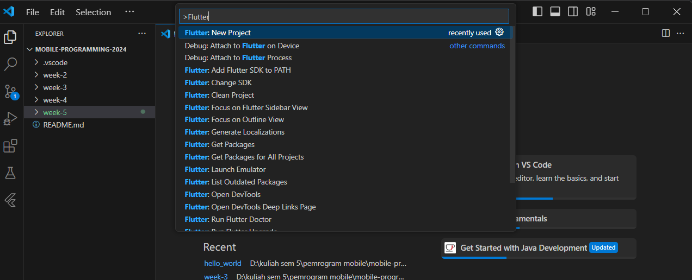
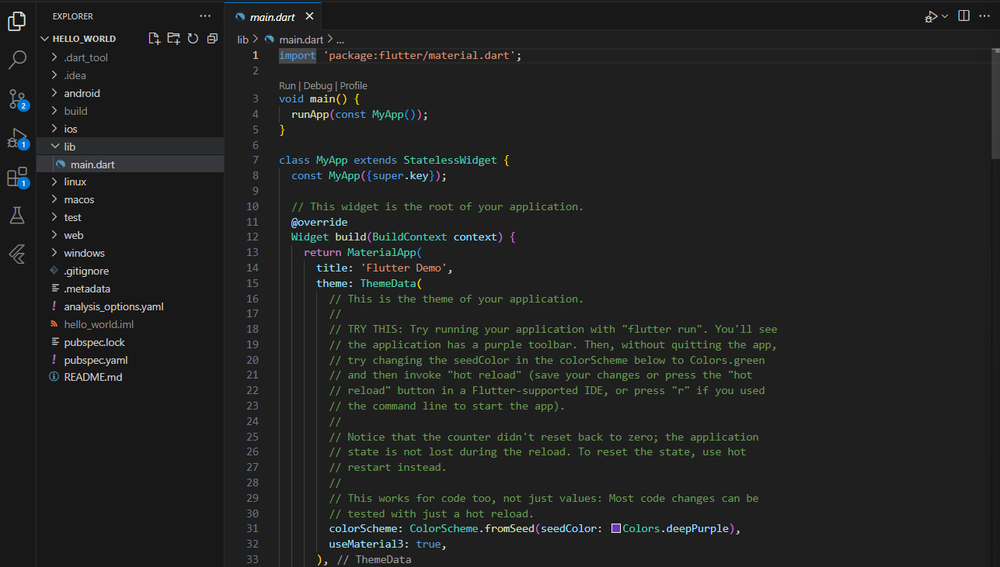

# Praktikum 2: Menghubungkan Perangkat Android atau Emulator
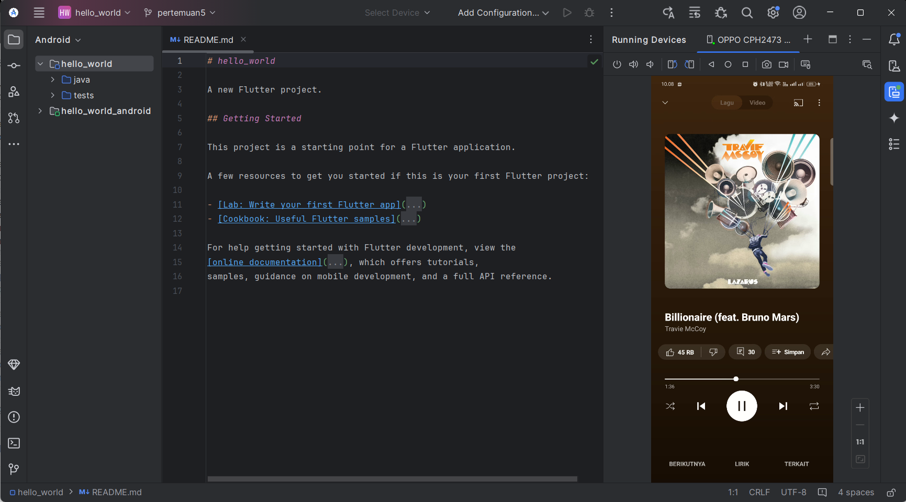

# Praktikum 3: Membuat Repository GitHub dan Laporan Praktikum

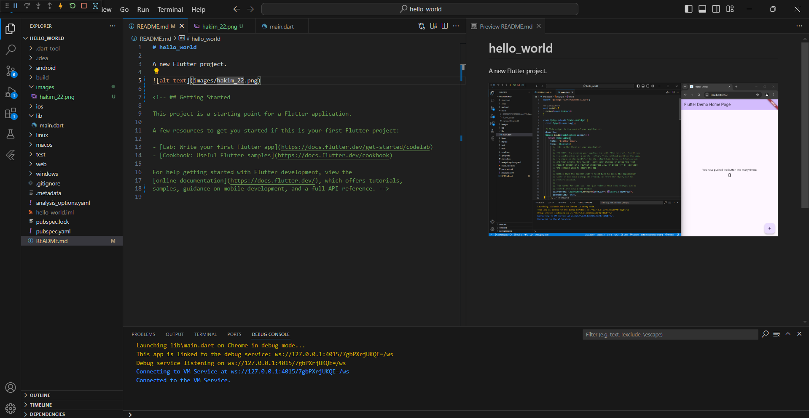

# Praktikum 4: Menerapkan Widget Dasar
* Text Widget
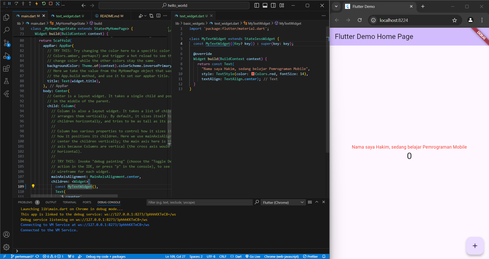
* Image Widget
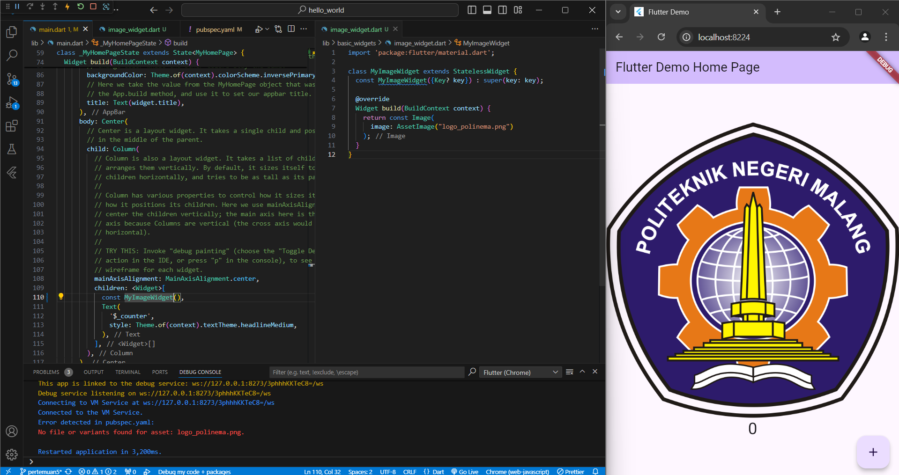

# Praktikum 5: Menerapkan Widget Material Design dan iOS Cupertino
* Cupertino Button dan Loading Bar
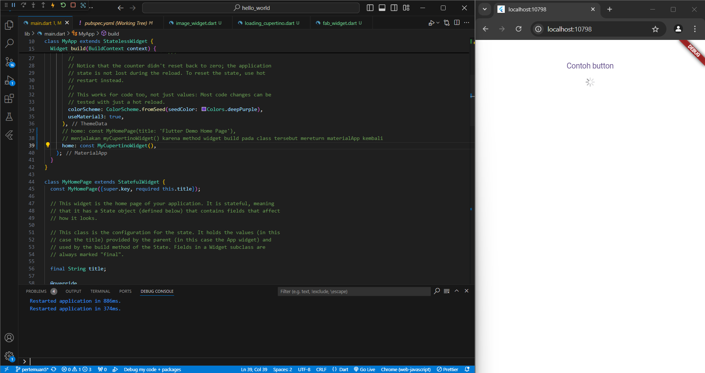
* Floating Action Button (FAB)
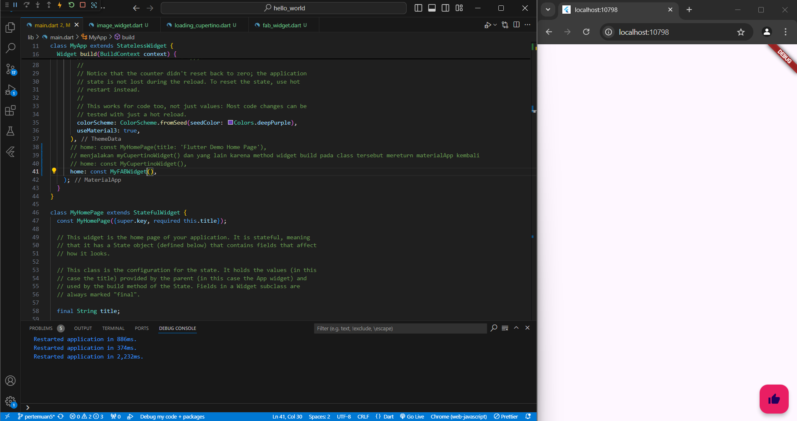
* Scaffold Widget
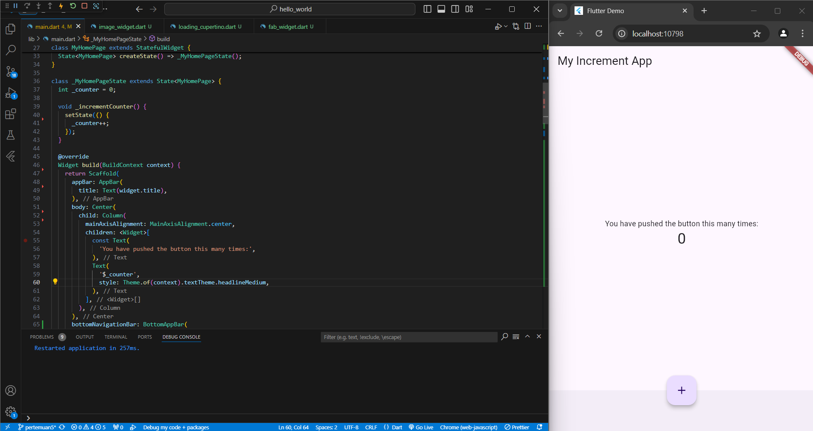
* Dialog Widget
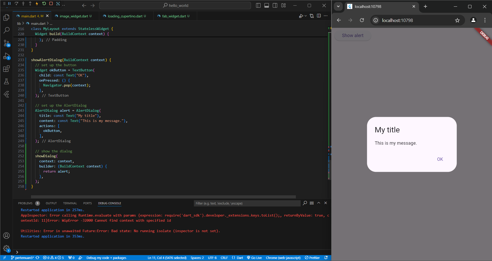
* Input dan Selection Widget
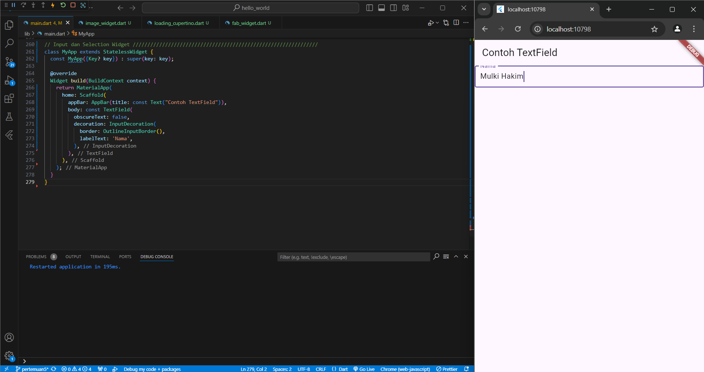
* Date and Time Pickers
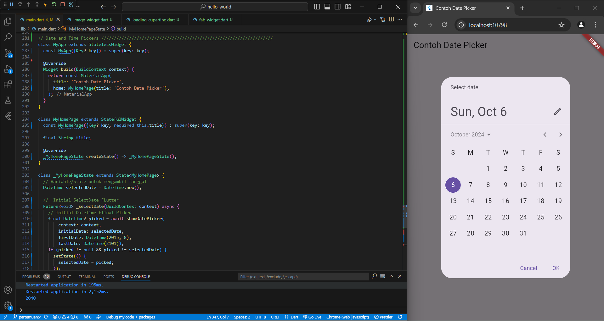