# 
 Laporan Pertemuan 3
## 
 Pemrograman Dasar Dart - Bag.2
## 
NIM: 2241720131
## 
Nama: Mulki Hakim
## 
Kelas: TI 3-B

# Praktikum 1: Membuat Project Flutter Baru
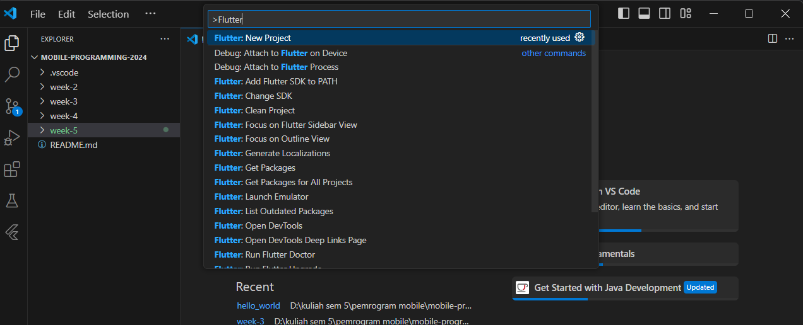
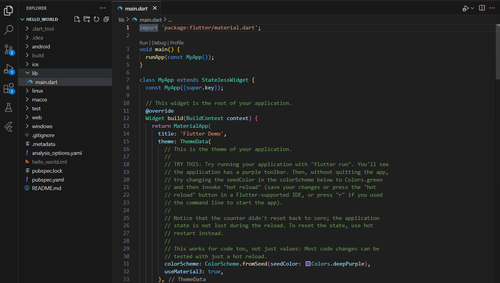

# Praktikum 2: Menghubungkan Perangkat Android atau Emulator
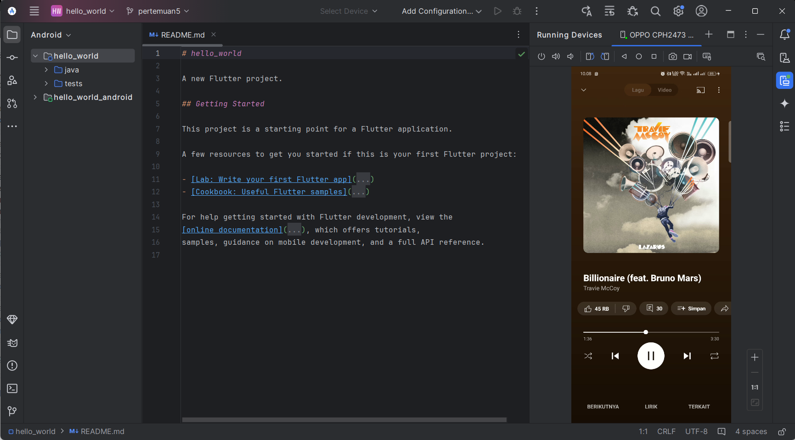

# Praktikum 3: Membuat Repository GitHub dan Laporan Praktikum

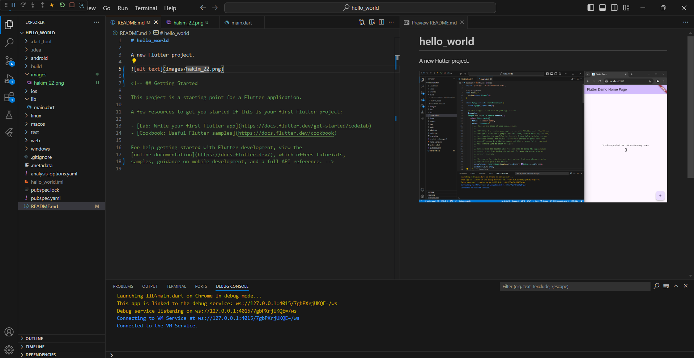

# Praktikum 4: Menerapkan Widget Dasar
* Text Widget
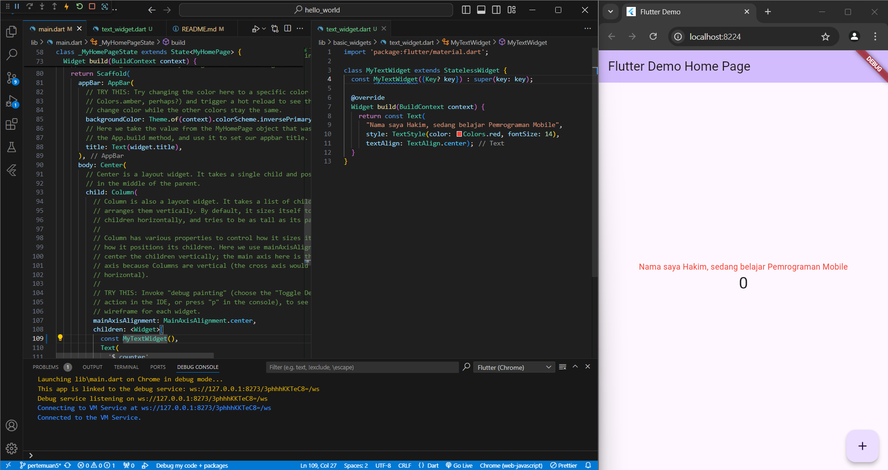
* Image Widget
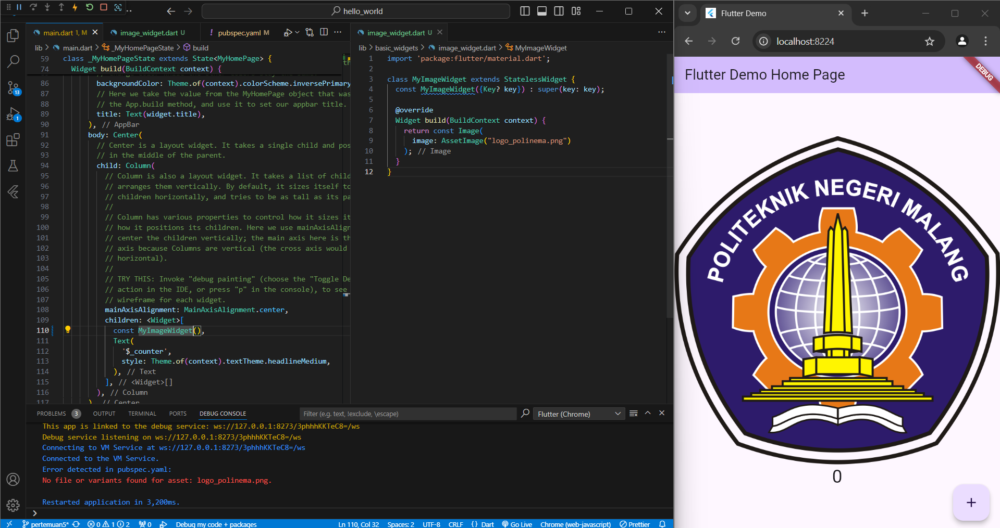

# Praktikum 5: Menerapkan Widget Material Design dan iOS Cupertino
* Cupertino Button dan Loading Bar
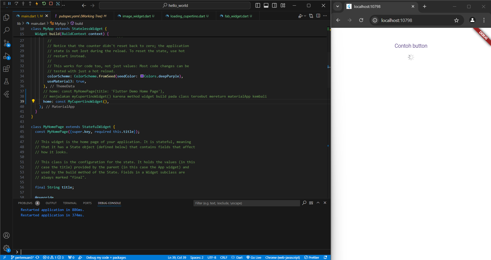
* Floating Action Button (FAB)
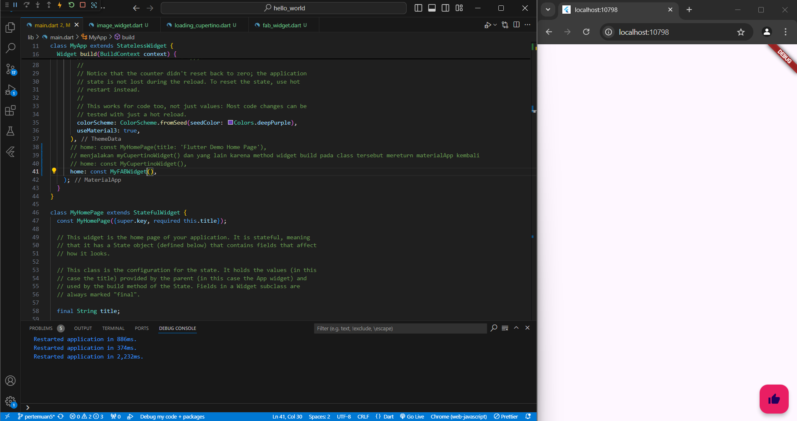
* Scaffold Widget
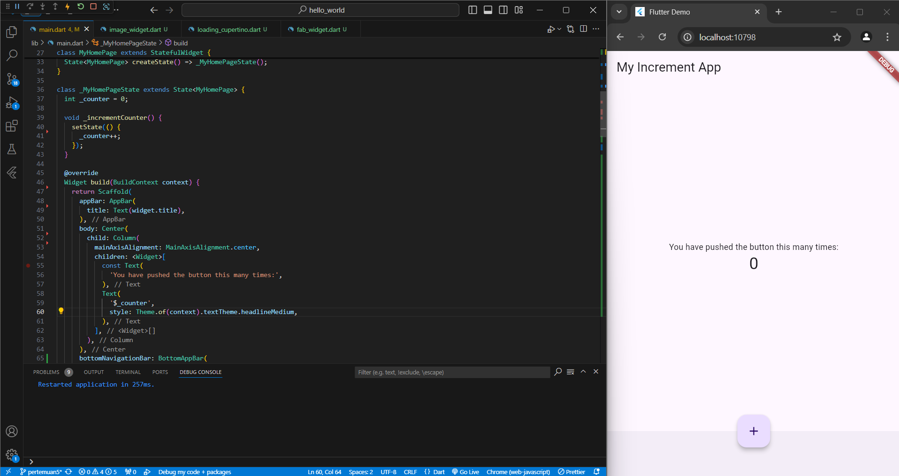
* Dialog Widget
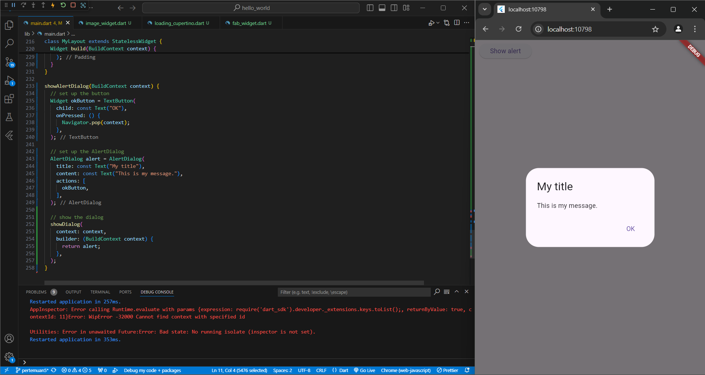
* Input dan Selection Widget
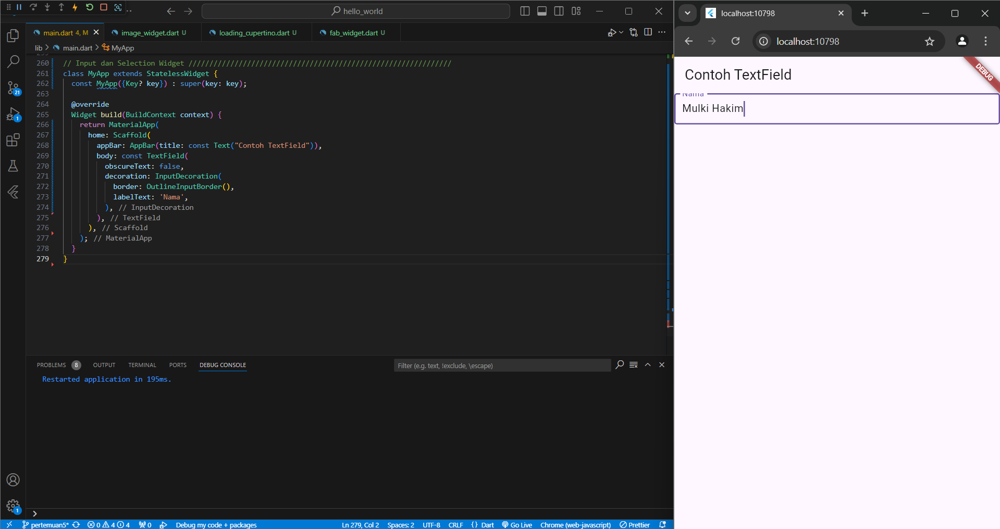
* Date and Time Pickers
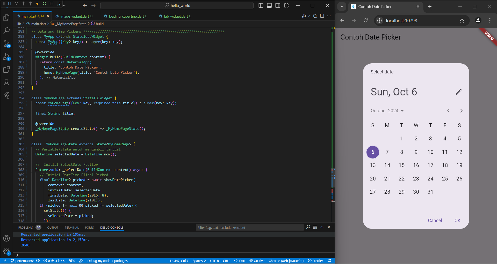

# Tugas Praktikum
1. Selesaikan Praktikum 1 sampai 5, lalu dokumentasikan dan push ke repository Anda berupa screenshot setiap hasil pekerjaan beserta penjelasannya di file README.md!

    jawab:

    Dokumentasi praktikum 1 sampai 5 ada di file LaporanPraktikum.md.
2. Selesaikan Praktikum 2 dan Anda wajib menjalankan aplikasi hello_world pada perangkat fisik (device Android/iOS) agar Anda mempunyai pengalaman untuk menghubungkan ke perangkat fisik. Capture hasil aplikasi di perangkat, lalu buatlah laporan praktikum pada file README.md.

    jawab:

    Capture dari perangkat saya sendiri

    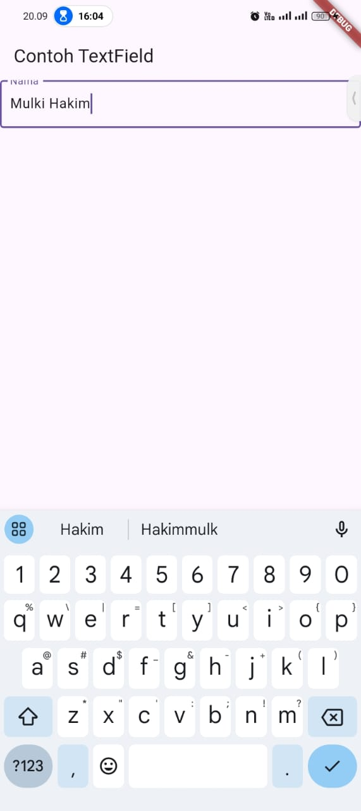

3. Pada praktikum 5 mulai dari Langkah 3 sampai 6, buatlah file widget tersendiri di folder basic_widgets, kemudian pada file main.dart cukup melakukan import widget sesuai masing-masing langkah tersebut!

    jawab:

    langkah 3 scaffold widget:

    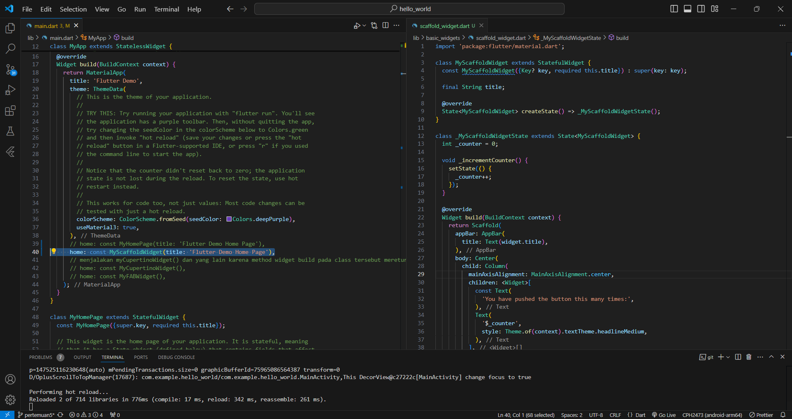

    hasil pemisahan file widget tersendiri sama saja:

    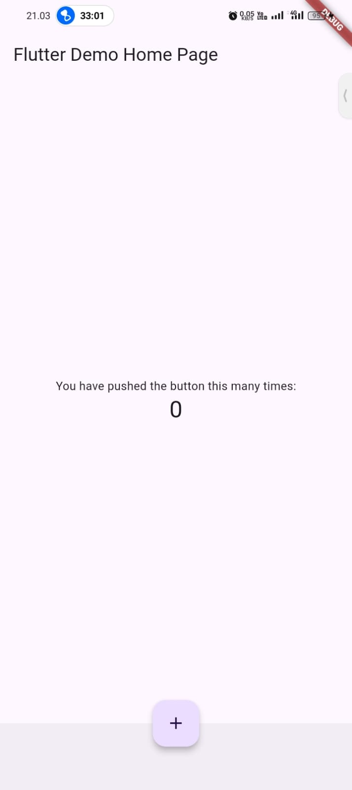

4. Selesaikan Codelabs: Your first Flutter app, lalu buatlah laporan praktikumnya dan push ke repository GitHub Anda!

* create a project

    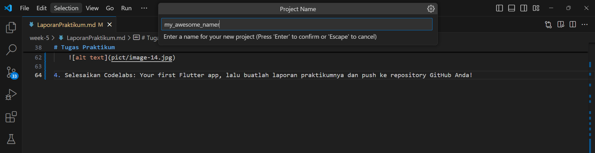
    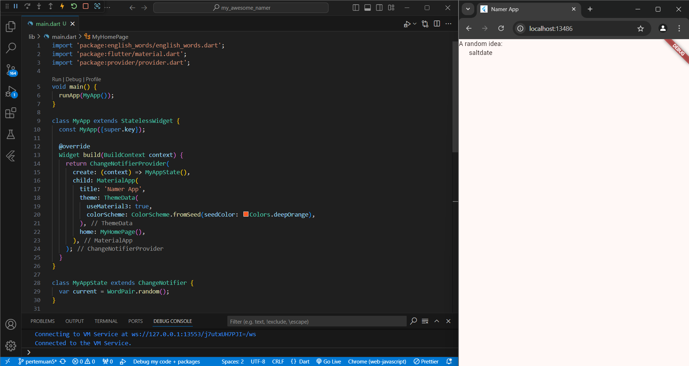

* add a button

    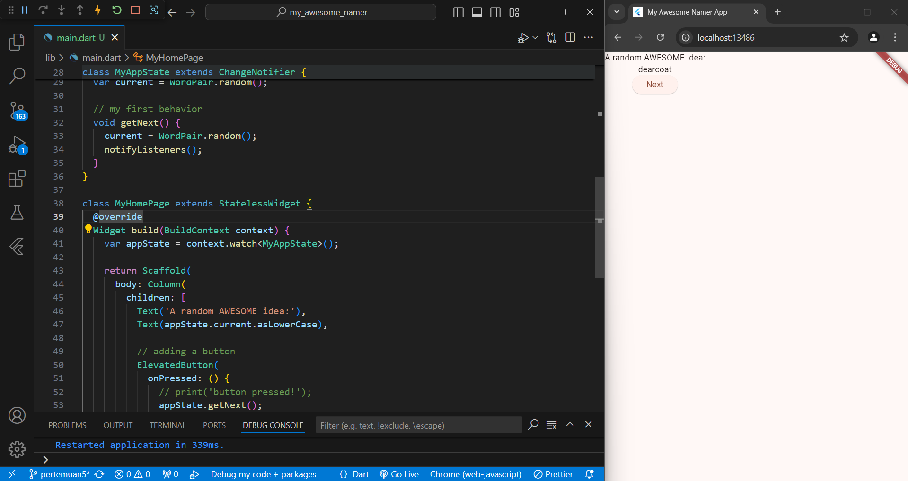

* Make the app prettier

    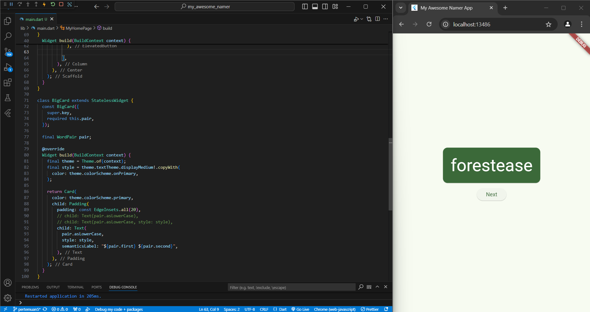

* Add functionality

    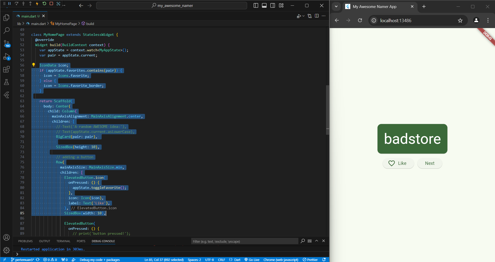

* Add navigation rail

    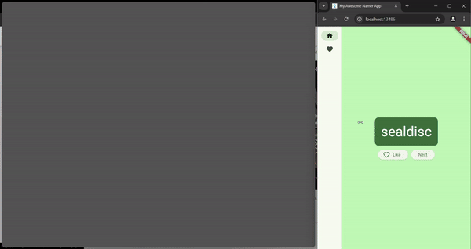

* Add a new page

    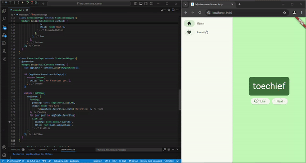

5. README.md berisi: capture hasil akhir tiap praktikum (side-by-side, bisa juga berupa file GIF agar terlihat proses perubahan ketika ada aksi dari pengguna) dengan menampilkan NIM dan Nama Anda sebagai ciri pekerjaan Anda.

6. Kumpulkan berupa link repository/commit GitHub Anda kepada dosen yang telah disepakati!