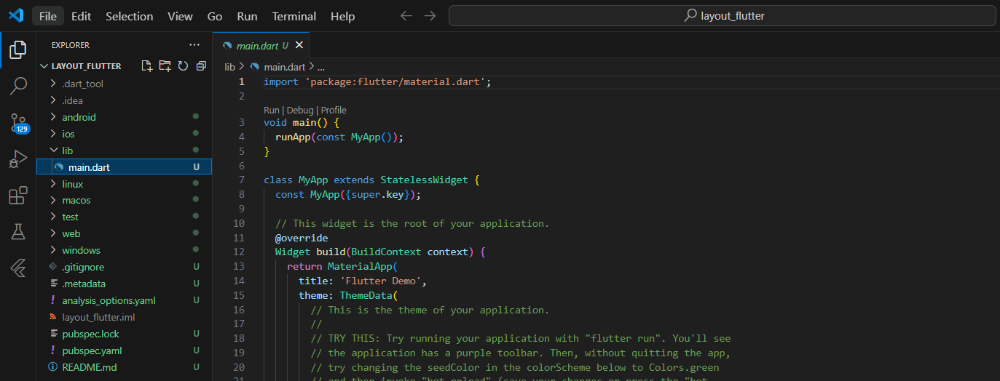
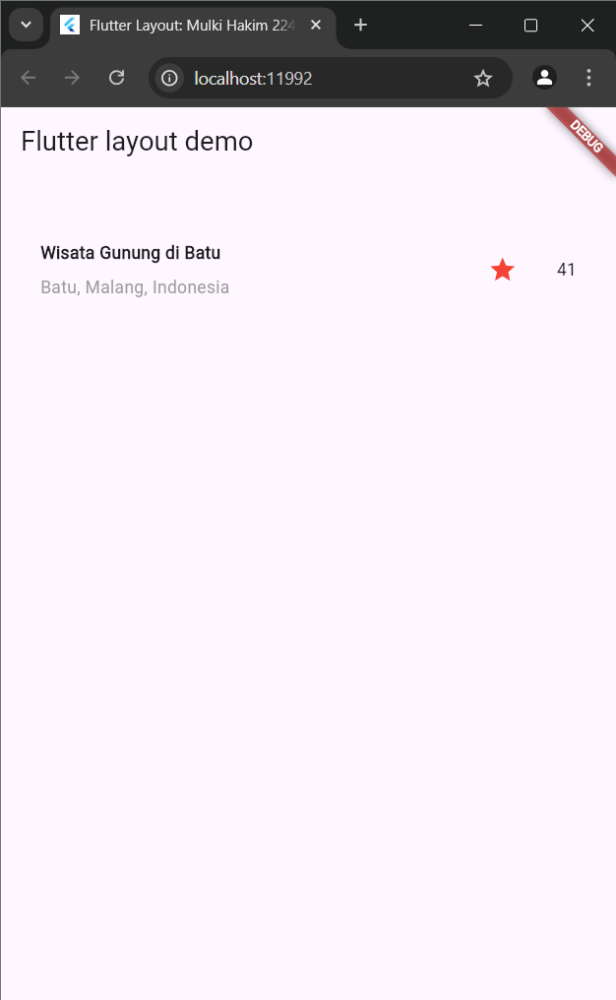
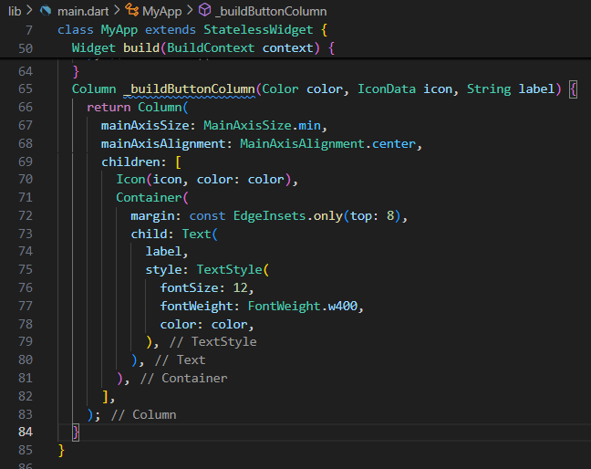
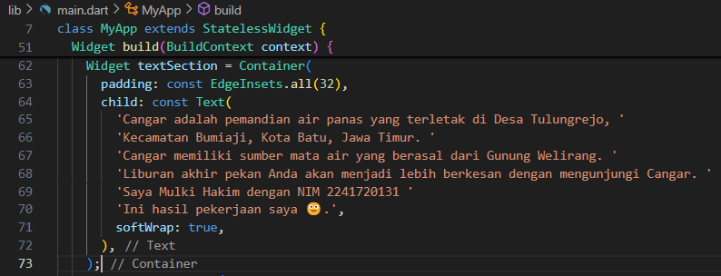
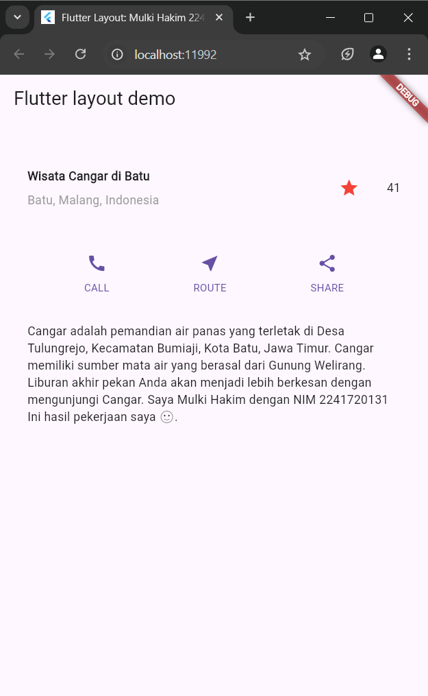

# 
 Laporan Pertemuan 6
## 
 Layout dan Navigasi
## 
NIM: 2241720131
## 
Nama: Mulki Hakim
## 
Kelas: TI 3-B

# Praktikum 1: Membangun Layout di Flutter
1. Buat project baru
    

2. Ganti kode pada file lib/main.dart
    

3. Identifikasi layout diagram
4. Implementasi title row
    

## hasil implementasi kode dari praktikum 1

# Praktikum 2: Implementasi button row
1. Buat method Column _buildButtonColumn
    

2. Buat widget buttonSection
    

3. Tambah button section ke body
    

## hasil implementasi kode dari praktikum 2

# Praktikum 3: Implementasi text section
1. Buat widget textSection
    

2. Tambahkan variabel text section ke body
    

## hasil implementasi kode dari praktikum 3

# Praktikum 4: Implementasi image section
1. Siapkan aset gambar
    
2. Tambahkan gambar ke body
    
3. Terakhir, ubah menjadi ListView
    

## hasil implementasi kode dari praktikum 4

    catatan tambahan: saat bagian body menggunakan widget `scroll` jika di zoom maka terdapat warning jika gambar yang ditampilkan mengalami overflow dan tampilan gambar tidak akan menyesuaikan dengan bagian dalam body yang lain, sehingga tidak dapat discrool ke bagian lain text, button, dll yang ada di dalam body. namun jika menggunakan widget `ListView` maka jika di zoom dan gambar menjadi overflow, gambar tersebut akan mengikuti bagian lain text, button, dll yang ada di dalam body sehingga dapat discrool untuk melihat bagian-bagian tersebut.

# Praktikum 5: Membangun Navigasi di Flutter
1. Siapkan project baru
2. Mendefinisikan Route
3. Lengkapi Kode di main.dart
4. Membuat data model
5. Lengkapi kode di class HomePage