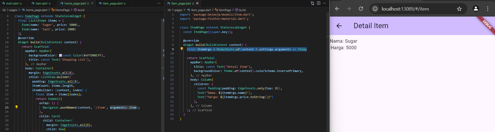

# <center> Laporan Pertemuan 6
## <center> Layout dan Navigasi
## <center>NIM: 2241720131
## <center>Nama: Mulki Hakim
## <center>Kelas: TI 3-B

# Praktikum 1: Membangun Layout di Flutter
1. Buat project baru

    

2. Ganti kode pada file lib/main.dart

    

3. Identifikasi layout diagram
4. Implementasi title row

    

## hasil implementasi kode dari praktikum 1


# Praktikum 2: Implementasi button row
1. Buat method Column _buildButtonColumn

    

2. Buat widget buttonSection

    

3. Tambah button section ke body

    

## hasil implementasi kode dari praktikum 2


# Praktikum 3: Implementasi text section
1. Buat widget textSection

    

2. Tambahkan variabel text section ke body

    

## hasil implementasi kode dari praktikum 3


# Praktikum 4: Implementasi image section
1. Siapkan aset gambar

    

2. Tambahkan gambar ke body

    

3. Terakhir, ubah menjadi ListView

    

## hasil implementasi kode dari praktikum 4

    catatan tambahan: saat bagian body menggunakan widget `scroll` jika di zoom maka terdapat warning jika gambar yang ditampilkan mengalami overflow dan tampilan gambar tidak akan menyesuaikan dengan bagian dalam body yang lain, sehingga tidak dapat discrool ke bagian lain text, button, dll yang ada di dalam body. namun jika menggunakan widget `ListView` maka jika di zoom dan gambar menjadi overflow, gambar tersebut akan mengikuti bagian lain text, button, dll yang ada di dalam body sehingga dapat discrool untuk melihat bagian-bagian tersebut.

# Praktikum 5: Membangun Navigasi di Flutter
1. Siapkan project baru

    

2. Mendefinisikan Route

    

3. Lengkapi Kode di main.dart

    

4. Membuat data model

    

5. Lengkapi kode di class HomePage

    

6. Membuat ListView dan itemBuilder

    

    Output:

    

7. Menambahkan aksi pada ListView

    saat item sebelumnya ditekan akan menampilkan tampilan di bawah karena belum diatur tampilannya.
    

# Tugas Praktikum 2
1. Untuk melakukan pengiriman data ke halaman berikutnya, cukup menambahkan informasi arguments pada penggunaan Navigator. Perbarui kode pada bagian Navigator menjadi seperti berikut.
    ```dart
    Navigator.pushNamed(context, '/item', arguments: item);
    ```
2. Pembacaan nilai yang dikirimkan pada halaman sebelumnya dapat dilakukan menggunakan ModalRoute. Tambahkan kode berikut pada blok fungsi build dalam halaman ItemPage. Setelah nilai didapatkan, anda dapat menggunakannya seperti penggunaan variabel pada umumnya. (https://docs.flutter.dev/cookbook/navigation/navigate-with-arguments)
    ```dart
    final itemArgs = ModalRoute.of(context)!.settings.arguments as Item;
    ```
    jawab:

    hasil implementasi dari no 1 dan nomor 2 membuat list item yang telah ada sebelumnya, jika ditekan maka akan menuju halaman ItemPage dimana menampilkan detail dari item yang dipilih/ditekan sebagai argumen item nya. berikut kode dan ouput setelah list item sugar ditekan.
    
    
3. Pada hasil akhir dari aplikasi belanja yang telah anda selesaikan, tambahkan atribut foto produk, stok, dan rating. Ubahlah tampilan menjadi GridView seperti di aplikasi marketplace pada umumnya.

    jawab: 
    - menambahkan atribut pada file item.dart(models)
        ```dart
        class Item {
            String name;
            String imagePath;
            int stock;
            double rate;
            int price;
            
            Item({
                required this.name, 
                required this.imagePath,
                required this.stock,
                required this.rate,
                required this.price
            });
        }
        ```
    - menambahkan foto, stok, rating pada list item
        ```dart
        class HomePage extends StatelessWidget {
            final List<Item> items = [
                Item(
                name: 'Sugar', 
                imagePath: 'images/gula.jpeg',
                stock: 4,
                rate: 4.6,
                price: 5000),
                Item(
                name: 'Salt', 
                imagePath: 'images/garam.jpeg',
                stock: 5,
                rate: 4.3,
                price: 2000)
            ];
        ```
    - mengubah tampilan menjadi GridView

        

4. Silakan implementasikan Hero widget pada aplikasi belanja Anda dengan mempelajari dari sumber ini: https://docs.flutter.dev/cookbook/navigation/hero-animations

    jawab: 
    - menambahkan hero widget pada item list di homePage

        

    - menambahkan hero widget pada ItemPage

        

5. Sesuaikan dan modifikasi tampilan sehingga menjadi aplikasi yang menarik. Selain itu, pecah widget menjadi kode yang lebih kecil. Tambahkan Nama dan NIM di footer aplikasi belanja Anda.

    hasil:

    

6. Selesaikan Praktikum 5: Navigasi dan Rute tersebut. Cobalah modifikasi menggunakan plugin go_router, lalu dokumentasikan dan push ke repository Anda berupa screenshot setiap hasil pekerjaan beserta penjelasannya di file README.md. Kumpulkan link commit repository GitHub Anda kepada dosen yang telah disepakati!

    jawab:
    - instal `go_router` package

        

    - konfigurasi `go_router` di main.dart

         

    - penyesuaian implementasi `go_router` pada homePage

        

    - penyesuaian implementasi `go_router` pada ItemPage

        