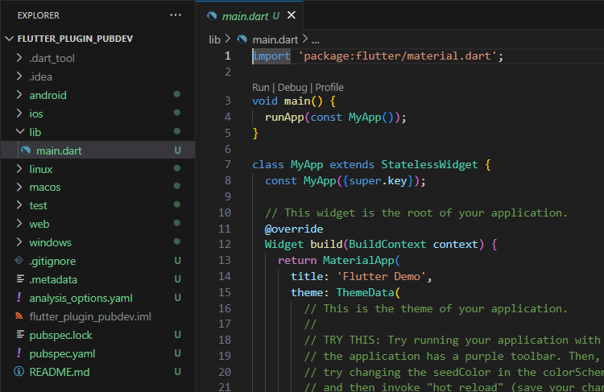
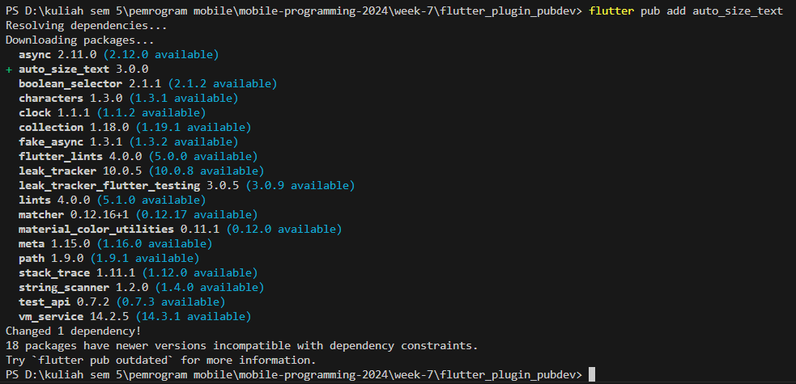
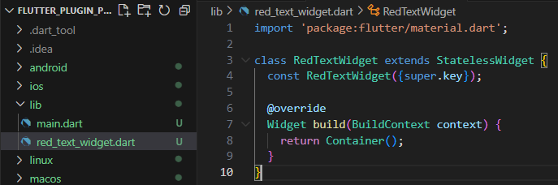
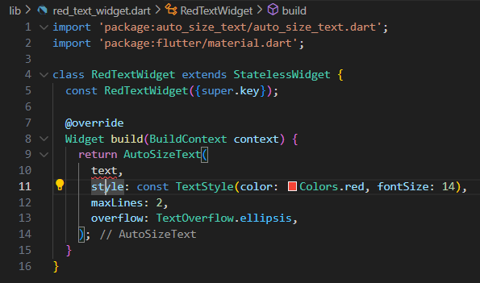
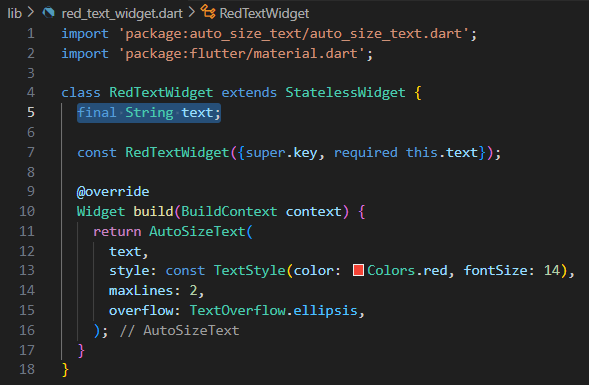
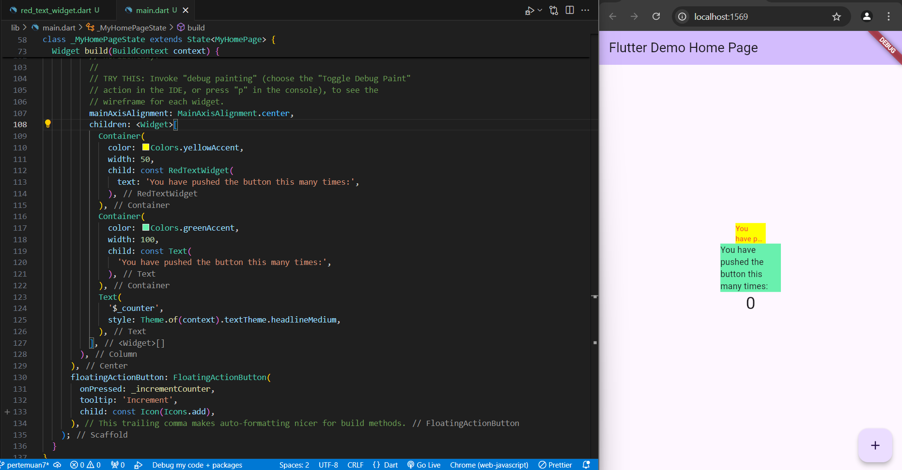

# 
Laporan Pertemuan 7
## 
Manajemen Plugin
## 
NIM: 2241720131
## 
Nama: Mulki Hakim
## 
Kelas: TI 3-B

# Praktikum Menerapkan Plugin di Project Flutter
1. Buat Project Baru

    

2. Menambahkan Plugin

    

3. Buat file red_text_widget.dart

    

4. Tambah Widget AutoSizeText

    
    
    terdapat eror, karena widget `AutoSizeText` tidak memiliki atribut/variabel dengan nama text.

5. Buat Variabel text dan parameter di constructor

    

6. Tambahkan widget di main.dart

    

# Tugas Praktikum
1. Selesaikan Praktikum tersebut, lalu dokumentasikan dan push ke repository Anda berupa screenshot hasil pekerjaan beserta penjelasannya di file README.md!
2. Jelaskan maksud dari langkah 2 pada praktikum tersebut!

    jawab:
    untuk menambahkan suatu pluggin melalui terminal, setelah perintah pada langkah tersebut dijalankan maka kemudian akan mengunduh plugin terkait lalu mengupdate konfigurasi dependencies yang digunakan aplikasi pada file `pubspec.yaml`, setelahnya fitur yang ada pada plugin tersebut dapat digunakan pada aplikasi yang akan dibuat. plugin yang di unduh tersebut telah terdaftar pada pub.dev.
    
3. Jelaskan maksud dari langkah 5 pada praktikum tersebut!

    jawab:
    untuk mendefinisikan atribut/variabel baru bertipe String, yang kemudian dijadikan variabel wajib untuk diisi/digunakan jika membuat objek dari class `RedTextWidget` dimana hal ini disebabkan dari pendefinisian method konstruktor nya juga. 

4. Pada langkah 6 terdapat dua widget yang ditambahkan, jelaskan fungsi dan perbedaannya!

    jawab;

    container pertama mengimplementasikan class `RedTextWidget` yang menggunakan plugin auto_size_text sehingga pengaturan text akan disesuaikan dengan pengaturan class `AutoSizeText` dari plugin tersebut.

    sedangkan container kedua mengimplementasikan widget `Text` yang telah ada dan diatur secara sederhana oleh framework flutter.
    
5. Jelaskan maksud dari tiap parameter yang ada di dalam plugin auto_size_text berdasarkan tautan pada dokumentasi [ini](https://pub.dev/documentation/auto_size_text/latest/) !

    jawab:

   <table>
        <thead>
            <tr>
                <td>Parameter</td>
                <td>Deskripsi</td>
            </tr>
        </thead>
        <tbody>
            <tr>
                <td>key</td>
                <td>Mengontrol bagaimana satu widget menggantikan widget lain di tree.</td>
            </tr>
            <tr>
                <td>textKey</td>
                <td>Mengatur kunci untuk widget Teks yang dihasilkan.</td>
            </tr>
            <tr>
                <td>style</td>
                <td>Melakukan manipulasi pada text.</td>
            </tr>
            <tr>
                <td>minFontSize</td>
                <td>Batasan ukuran teks minimum yang akan digunakan saat mengubah ukuran teks secara otomatis. Diabaikan jika presetFontSizes diatur.</td>
            </tr>
            <tr>
                <td>maxFontSize</td>
                <td>The maximum text size constraint to be used when auto-sizing text. Is being ignored if presetFontSizes is set.</td>
            </tr>
            <tr>
                <td>stepGranularity</td>
                <td>The step size in which the font size is being adapted to constraints.</td>
            </tr>
            <tr>
                <td>presetFontSizes</td>
                <td>Mendefinisikan semua ukuran font yang mungkin. Penting: presetFontSizes harus dalam urutan menurun.</td>
            </tr>
            <tr>
                <td>group</td>
                <td>Menyinkronkan ukuran beberapa AutoSizeText</td>
            </tr>
            <tr>
                <td>textAlign</td>
                <td>Bagaimana teks harus disejajarkan secara horizontal.</td>
            </tr>
            <tr>
                <td>textDirection</td>
                <td>Arah teks. Ini menentukan bagaimana nilai textAlign seperti TextAlign.start dan TextAlign.end.</td>
            </tr>
            <tr>
                <td>locale</td>
                <td>Digunakan untuk memilih font ketika karakter Unicode yang sama dapat dirender secara berbeda, tergantung pada lokasi.</td>
            </tr>
            <tr>
                <td>softWrap</td>
                <td>Apakah teks harus berhenti pada jeda baris sesuai ukuran Widget yang menampung.</td>
            </tr>
            <tr>
                <td>wrapWords</td>
                <td>Apakah kata-kata yang tidak muat dalam satu baris harus dibungkus. Defaultnya adalah true.</td>
            </tr>
            <tr>
                <td>overflow</td>
                <td>Bagaimana overflow harus ditangani.</td>
            </tr>
            <tr>
                <td>overflow</td>
                <td>Untuk menangani overflow.</td>
            </tr>
            <tr>
                <td>overflowReplacement</td>
                <td>Jika teks meluap dan tidak sesuai dengan batasnya, widget ini akan ditampilkan.</td>
            </tr>
            <tr>
                <td>textScaleFactor</td>
                <td>Jumlah piksel font untuk setiap piksel. Juga memengaruhi minFontSize, maxFontSize, dan presetFontSizes.</td>
            </tr>
            <tr>
                <td>maxLines</td>
                <td>Jumlah maksimal baris yang di buat.</td>
            </tr>
            <tr>
                <td>semanticsLabel</td>
                <td>Membuat label semantic pada teks ini.</td>
            </tr>
        </tbody>
    </table>