# <center>Laporan Pertemuan 9
## <center>Kamera
## <center>NIM: 2241720131
## <center>Nama: Mulki Hakim
## <center>Kelas: TI 3-B

# Praktikum 1: Mengambil Foto dengan Kamera di Flutter

1. Buat Project Baru

    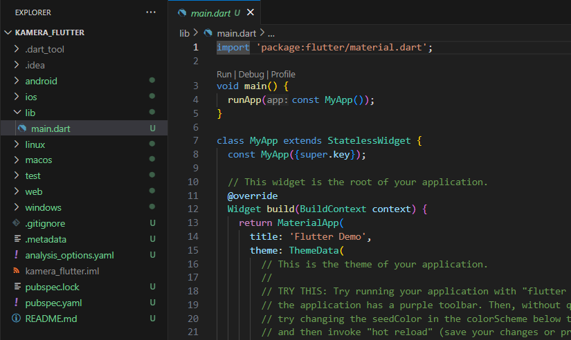
    
2. Tambah dependensi yang diperlukan

    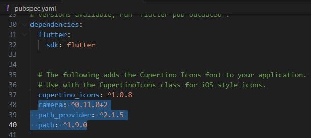

3. Ambil Sensor Kamera dari device

    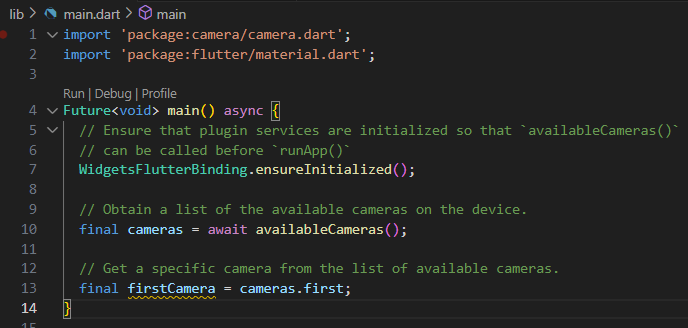
    
4. Buat dan inisialisasi CameraController

    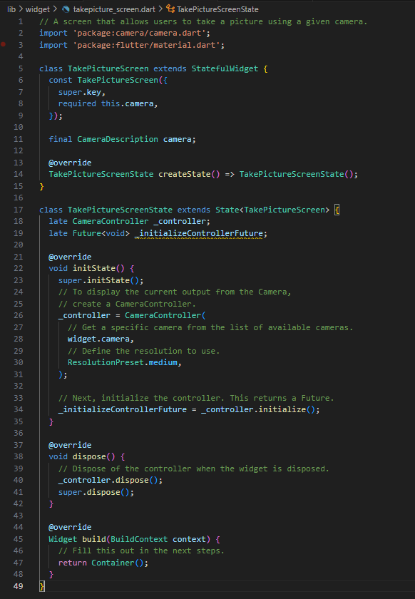

5. Gunakan CameraPreview untuk menampilkan preview foto

    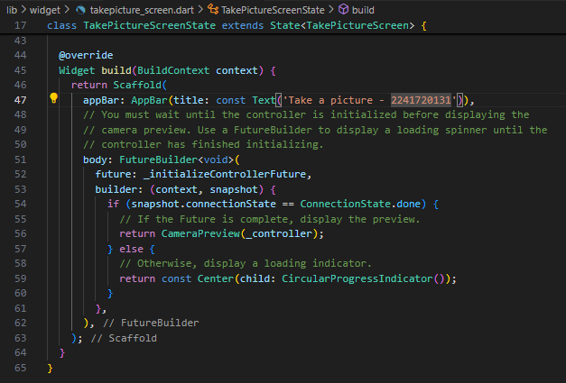

6. Ambil foto dengan CameraController

    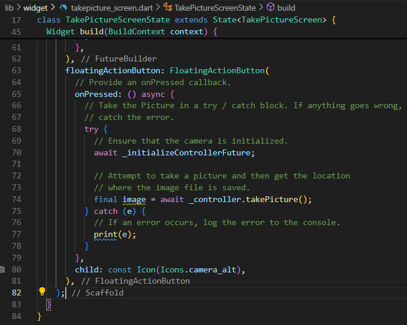

7. Buat widget baru DisplayPictureScreen

    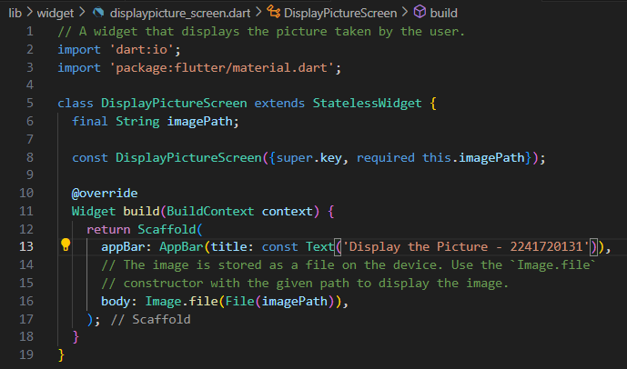
    
8. Edit main.dart

    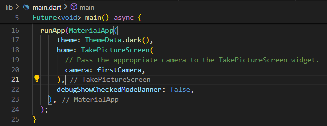

9. Menampilkan hasil foto

    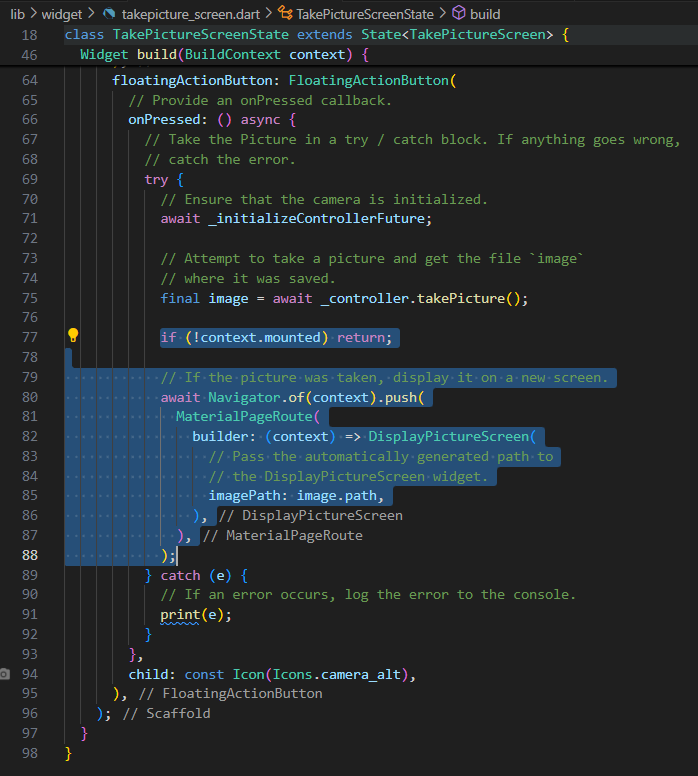

    Hasil

    

# Praktikum 2: Membuat photo filter carousel

1. Buat project baru

    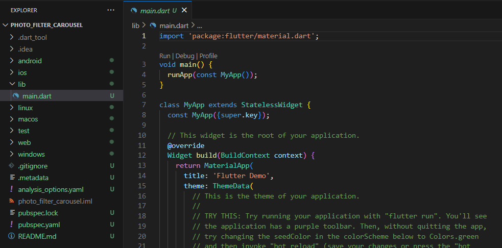

2. Buat widget Selector ring dan dark gradient

   `lib/widget/filter_selector.dart`

    ```dart
    import 'package:flutter/material.dart';
    import 'package:flutter/rendering.dart';

    @immutable
    class FilterSelector extends StatefulWidget {
        const FilterSelector({
            super.key,
            required this.filters,
            required this.onFilterChanged,
            this.padding = const EdgeInsets.symmetric(vertical: 24),
        });

        final List<Color> filters;
        final void Function(Color selectedColor) onFilterChanged;
        final EdgeInsets padding;

        @override
        State<FilterSelector> createState() => _FilterSelectorState();
    }

    class _FilterSelectorState extends State<FilterSelector> {
        static const _filtersPerScreen = 5;
        static const _viewportFractionPerItem = 1.0 / _filtersPerScreen;

        late final PageController _controller;
        late int _page;

        int get filterCount => widget.filters.length;

        Color itemColor(int index) => widget.filters[index % filterCount];

        @override
        void initState() {
            super.initState();
            _page = 0;
            _controller = PageController(
            initialPage: _page,
            viewportFraction: _viewportFractionPerItem,
            );
            _controller.addListener(_onPageChanged);
        }

        void _onPageChanged() {
            final page = (_controller.page ?? 0).round();
            if (page != _page) {
            _page = page;
            widget.onFilterChanged(widget.filters[page]);
            }
        }

        void _onFilterTapped(int index) {
            _controller.animateToPage(
            index,
            duration: const Duration(milliseconds: 450),
            curve: Curves.ease,
            );
        }

        @override
        void dispose() {
            _controller.dispose();
            super.dispose();
        }

        @override
        Widget build(BuildContext context) {
            return Scrollable(
                controller: _controller,
                axisDirection: AxisDirection.right,
                physics: const PageScrollPhysics(),
                viewportBuilder: (context, viewportOffset) {
                    return LayoutBuilder(
                        builder: (context, constraints) {
                            final itemSize = constraints.maxWidth * _viewportFractionPerItem;
                            viewportOffset
                            ..applyViewportDimension(constraints.maxWidth)
                            ..applyContentDimensions(0.0, itemSize * (filterCount - 1));

                            return Stack(
                                alignment: Alignment.bottomCenter,
                                children: [
                                    _buildShadowGradient(itemSize),
                                    _buildCarousel(
                                    viewportOffset: viewportOffset,
                                    itemSize: itemSize,
                                    ),
                                    _buildSelectionRing(itemSize),
                                ],
                            );
                        },
                    );
                },
            );
        }

        Widget _buildShadowGradient(double itemSize) {
            return SizedBox(
                height: itemSize * 2 + widget.padding.vertical,
                child: const DecoratedBox(
                    decoration: BoxDecoration(
                        gradient: LinearGradient(
                            begin: Alignment.topCenter,
                            end: Alignment.bottomCenter,
                            colors: [
                            Colors.transparent,
                            Colors.black,
                            ],
                        ),
                    ),
                    child: SizedBox.expand(),
                ),
            );
        }

        Widget _buildCarousel({
            required ViewportOffset viewportOffset,
            required double itemSize,
        }) {
            return Container(
                height: itemSize,
                margin: widget.padding,
                child: Flow(
                    delegate: CarouselFlowDelegate(
                    viewportOffset: viewportOffset,
                    filtersPerScreen: _filtersPerScreen,
                    ),
                    children: [
                    for (int i = 0; i < filterCount; i++)
                        FilterItem(
                        onFilterSelected: () => _onFilterTapped(i),
                        color: itemColor(i),
                        ),
                    ],
                ),
            );
        }

        Widget _buildSelectionRing(double itemSize) {
            return IgnorePointer(
                child: Padding(
                    padding: widget.padding,
                    child: SizedBox(
                        width: itemSize,
                        height: itemSize,
                        child: const DecoratedBox(
                            decoration: BoxDecoration(
                                shape: BoxShape.circle,
                                border: Border.fromBorderSide(
                                    BorderSide(width: 6, color: Colors.white),
                                ),
                            ),
                        ),
                    ),
                ),
            );
        }
    }
    ```

3. Buat widget photo filter carousel

    `lib/widget/filter_carousel.dart`

    ```dart
    import 'package:flutter/material.dart';
    import 'package:photo_filter_carousel/widget/filter_selector.dart';

    @immutable
    class PhotoFilterCarousel extends StatefulWidget {
        const PhotoFilterCarousel({super.key});

        @override
        State<PhotoFilterCarousel> createState() => _PhotoFilterCarouselState();
        }

    class _PhotoFilterCarouselState extends State<PhotoFilterCarousel> {
        final _filters = [
            Colors.white,
            ...List.generate(
            Colors.primaries.length,
            (index) => Colors.primaries[(index * 4) % Colors.primaries.length],
            )
        ];

        final _filterColor = ValueNotifier<Color>(Colors.white);

        void _onFilterChanged(Color value) {
            _filterColor.value = value;
        }

        @override
        Widget build(BuildContext context) {
            return Material(
                color: Colors.black,
                child: Stack(
                    children: [
                        Positioned.fill(
                            child: _buildPhotoWithFilter(),
                        ),
                        Positioned(
                            left: 0.0,
                            right: 0.0,
                            bottom: 0.0,
                            child: _buildFilterSelector(),
                        ),
                    ],
                ),
            );
        }

        Widget _buildPhotoWithFilter() {
            return ValueListenableBuilder(
                valueListenable: _filterColor,
                builder: (context, color, child) {
                    // Anda bisa ganti dengan foto Anda sendiri
                    return Image.network(
                    'https://docs.flutter.dev/cookbook/img-files'
                    '/effects/instagram-buttons/millennial-dude.jpg',
                    color: color.withOpacity(0.5),
                    colorBlendMode: BlendMode.color,
                    fit: BoxFit.cover,
                    );
                },
            );
        }

        Widget _buildFilterSelector() {
            return FilterSelector(
            onFilterChanged: _onFilterChanged,
            filters: _filters,
            );
        }
    }
    ```

4. Membuat filter warna - bagian 1

    `lib/widget/carousel_flowdelegate.dart`

    ```dart
    import 'package:flutter/rendering.dart';
    import 'dart:math' as math;

    class CarouselFlowDelegate extends FlowDelegate {
        CarouselFlowDelegate({
            required this.viewportOffset,
            required this.filtersPerScreen,
        }) : super(repaint: viewportOffset);

        final ViewportOffset viewportOffset;
        final int filtersPerScreen;

        @override
        void paintChildren(FlowPaintingContext context) {
            final count = context.childCount;

            // All available painting width
            final size = context.size.width;

            // The distance that a single item "page" takes up from the perspective
            // of the scroll paging system. We also use this size for the width and
            // height of a single item.
            final itemExtent = size / filtersPerScreen;

            // The current scroll position expressed as an item fraction, e.g., 0.0,
            // or 1.0, or 1.3, or 2.9, etc. A value of 1.3 indicates that item at
            // index 1 is active, and the user has scrolled 30% towards the item at
            // index 2.
            final active = viewportOffset.pixels / itemExtent;

            // Index of the first item we need to paint at this moment.
            // At most, we paint 3 items to the left of the active item.
            final min = math.max(0, active.floor() - 3).toInt();

            // Index of the last item we need to paint at this moment.
            // At most, we paint 3 items to the right of the active item.
            final max = math.min(count - 1, active.ceil() + 3).toInt();

            // Generate transforms for the visible items and sort by distance.
            for (var index = min; index <= max; index++) {
                final itemXFromCenter = itemExtent * index - viewportOffset.pixels;
                final percentFromCenter = 1.0 - (itemXFromCenter / (size / 2)).abs();
                final itemScale = 0.5 + (percentFromCenter * 0.5);
                final opacity = 0.25 + (percentFromCenter * 0.75);

                final itemTransform = Matrix4.identity()
                    ..translate((size - itemExtent) / 2)
                    ..translate(itemXFromCenter)
                    ..translate(itemExtent / 2, itemExtent / 2)
                    ..multiply(Matrix4.diagonal3Values(itemScale, itemScale, 1.0))
                    ..translate(-itemExtent / 2, -itemExtent / 2);

                context.paintChild(
                    index,
                    transform: itemTransform,
                    opacity: opacity,
                );
            }
        }

        @override
        bool shouldRepaint(covariant CarouselFlowDelegate oldDelegate) {
            return oldDelegate.viewportOffset != viewportOffset;
        }
    }
    ```
5. Membuat filter warna

    `lib/widget/filter_item.dart`

    ```dart
    import 'package:flutter/material.dart';

    @immutable
    class FilterItem extends StatelessWidget {
        const FilterItem({
            super.key,
            required this.color,
            this.onFilterSelected,
        });

        final Color color;
        final VoidCallback? onFilterSelected;

        @override
        Widget build(BuildContext context) {
            return GestureDetector(
                onTap: onFilterSelected,
                child: AspectRatio(
                    aspectRatio: 1.0,
                    child: Padding(
                        padding: const EdgeInsets.all(8),
                        child: ClipOval(
                            child: Image.network(
                            'https://docs.flutter.dev/cookbook/img-files'
                            '/effects/instagram-buttons/millennial-texture.jpg',
                            color: color.withOpacity(0.5),
                            colorBlendMode: BlendMode.hardLight,
                            ),
                        ),
                    ),
                ),
            );
        }
    }
    ```

6. Implementasi filter carousel

    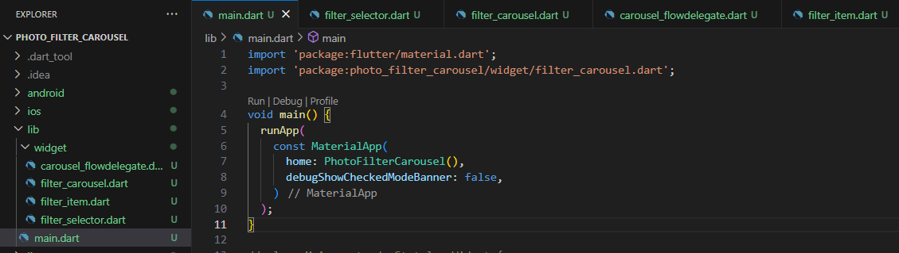

    hasil

    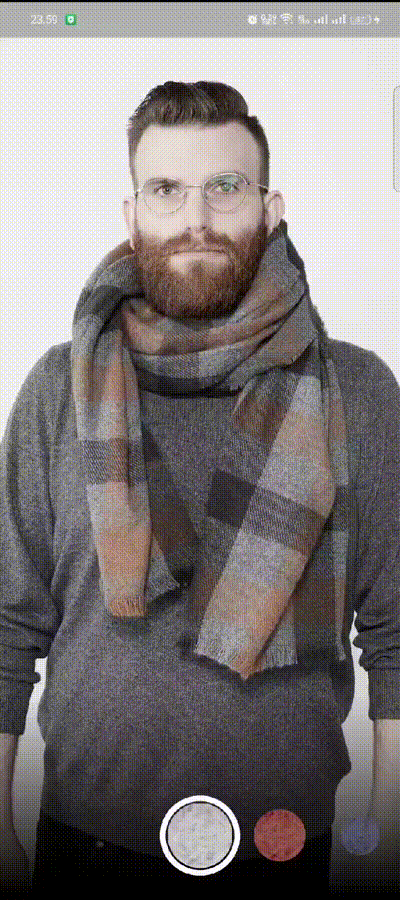

# Tugas Praktikum

1. Selesaikan Praktikum 1 dan 2, lalu dokumentasikan dan push ke repository Anda berupa screenshot setiap hasil pekerjaan beserta penjelasannya di file README.md! Jika terdapat error atau kode yang tidak dapat berjalan, silakan Anda perbaiki sesuai tujuan aplikasi dibuat!
2. Gabungkan hasil praktikum 1 dengan hasil praktikum 2 sehingga setelah melakukan pengambilan foto, dapat dibuat filter carouselnya!
    - mamasukkan file-file yang dilakukan di praktikum 2 ke praktikum 1

        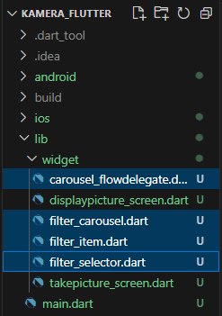
    - menambahkan variabel `final String filePath` untuk menyimpan filePath dari gambar yang diambil, kemudian variabel tersebut di konfigurasi dengan class yang berurusan dengan proses pemberian filter pada foto yaitu class `PhotoFilterCarousel` di file `filter_carousel.dart`

        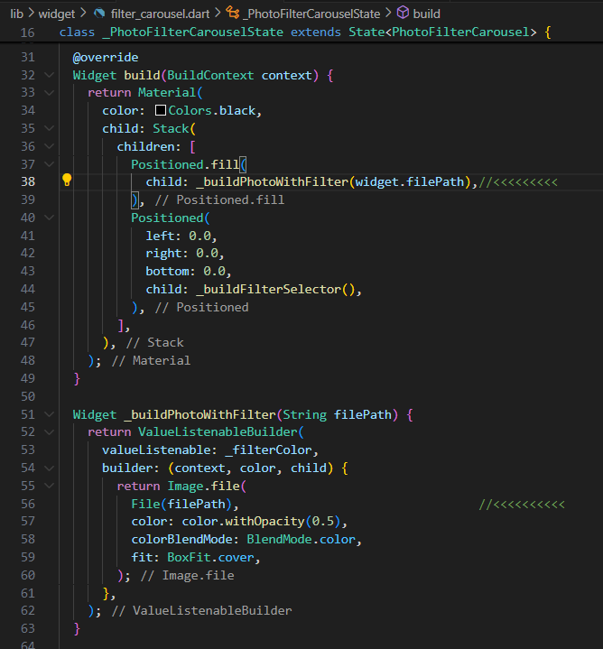

    - class `PhotoFilterCarousel` yang sudah di sesuaikan tadi, selanjutnya diterapkan di class yang memproses untuk menampilkan hasil tangkapan gambar yaitu class `DisplayPictureScreen`

        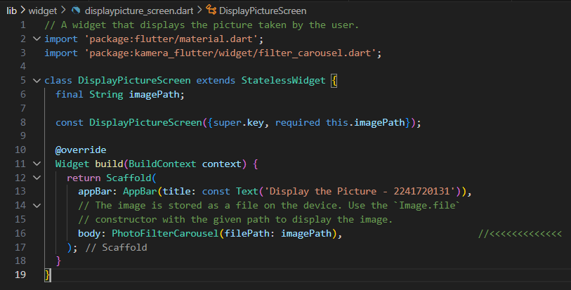

    - hasil

        
3. Jelaskan maksud void async pada praktikum 1?

    jawab: 
    
    Fungsi void main() async menandai bahwa fungsi main bersifat asinkron. Ini berarti fungsi tersebut dapat menjalankan operasi asinkron, seperti menunggu (await) penyelesaian tugas-tugas yang memakan waktu (misalnya, mendapatkan daftar kamera). Penggunaan async memungkinkan fungsi untuk menunggu penyelesaian tugas tanpa memblokir eksekusi program secara keseluruhan. Hal ini memastikan aplikasi tetap responsif dan bisa menyelesaikan inisialisasi sebelum menjalankan aplikasi Flutter dengan memanggil runApp.
    
4. Jelaskan fungsi dari anotasi @immutable dan @override ?

    jawab:

    * Anotasi @immutable digunakan untuk menandai suatu kelas sebagai tidak dapat diubah (immutable). Ini berarti bahwa setelah sebuah objek dari kelas tersebut dibuat, nilai dari properti-propertinya tidak dapat diubah. Biasanya digunakan pada kelas data atau model yang seharusnya tetap tidak berubah setelah diinisialisasi. Ini membantu menghindari bug yang mungkin terjadi karena perubahan yang tidak disengaja pada objek.

    * Anotasi @override digunakan untuk menandakan bahwa suatu metode yang didefinisikan dalam kelas adalah metode yang meng-override (mengganti) metode yang didefinisikan dalam kelas induk (superclass). Ini membantu memastikan bahwa metode dari superclass benar-benar diganti dan juga membantu compiler memberikan peringatan jika ada kesalahan.
